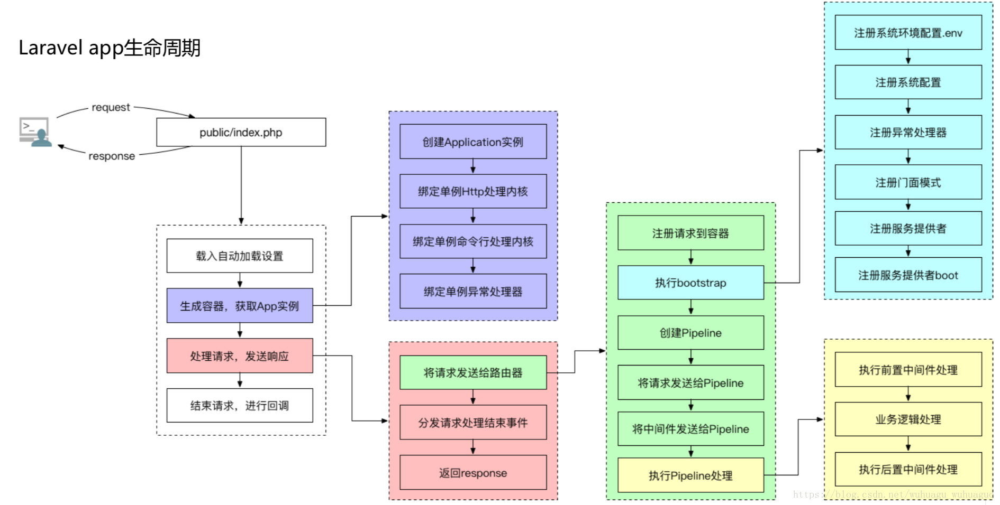
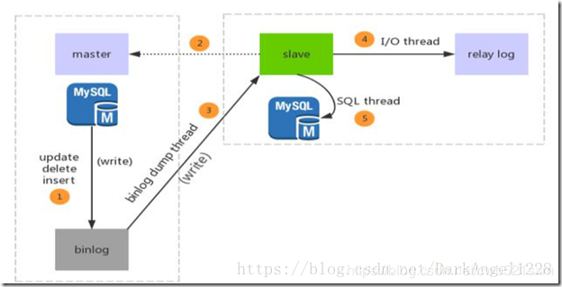
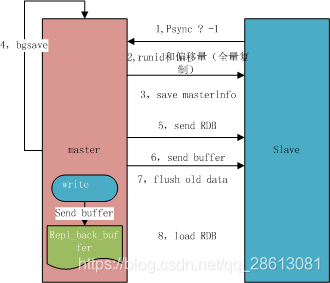
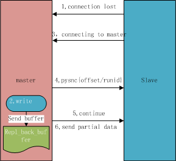

# php
## php基础
### 底层原理
PHP语言的整体架构图(包括其核心的组成模块即可)

   

    Application: 程序员编写的 PHP 程序，无论是 Web 应用还是 Cli 方式运行的应用都是上层应用，PHP 程序员主要工作就是编写它们。 
    
    SAPI:SAPI 是 Server Application Programming Interface 的缩写，中文为服务端应用编程接口，
    它通过一系列钩子函数使得 PHP 可以和外 围交换数据，SAPI 就是 PHP 和外部环境的代理器，
    它把外部环境抽象后，为内部的 PHP 提供一套固定的，统一的接口，使得 PHP 自身实现能够
    不受错综 复杂的外部环境影响，保持一定的独立性。 通过 SAPI 的解耦，PHP 可以不再考虑如
    何针对不同应用进行兼容，而应用本身也可以针对自己的特点实现不同的处理方式。 
    
    Extensions 扩展：常见的内置函数、标准库都是通过 extension 来实现的，这些叫做 PHP 的核心扩展，
    用户也可以根据自己的要求安装 PHP 的扩展 
    
    Zend 引擎:Zend 引擎是 PHP4 以后加入 PHP 的，是对原有 PHP 解释器的重写，整体使用 C 语言进行开发，
    也就是说可以把 PHP 理解成用 C 写的 一个编程语言软件，引擎的作用是将 PHP 代码翻译为一种叫 
    opcode 的中间语言，它类似于 JAVA 的 ByteCode（字节码）。 引擎对 PHP 代码会执行四个: 
    	1. 词法分析 Scanning（Lexing），将 PHP 代码转换为语言片段（Tokens）。 
    	2. 解析 Parsing， 将 Tokens 转换成简单而有意义的表达式。 
    	3. 编译 Compilation，将表达式编译成 Opcode。 
    	4. 执行 Execution，顺序执行 Opcode，每次一条，以实现 PHP 代码所表达的功能 
    	APC、Opchche 这些扩展可以将 Opcode 缓存以加速 PHP 应用的运行速度，
    使用它们就可以在请求再次来临时省略前三步。 
    引擎也实现了基本的数据结构、内存分配及管理，提供了相应的 API 方法供外部调用。
    
PHP的垃圾回收集机制

    引擎在判断一个变量空间是否能够被释放的时候是依据这个变量的zval的refcount的值，
    如果refcount为0，那么变量的空间可以被释放，否则就不释放，这是一种非常简单的GC实现

CgI、php-cgi、 Fastcgi、 php-fpm 几者的关系

    CGI全称是“公共网关接口”，HTTP服务器与你的或其它机器上的程序进行“交谈”的一种工具，
    其程序须运行在网络服务器上只要激活后，每次都要花费时间去fork一次
    
	FastCGI像是一个常驻(long-live)型的CGI，它可以一直执行着，只要激活后，
	不会每次都要花费时间去fork一次（这是CGI最为人诟病的fork-and-execute 模式）。
	它还支持分布式的运算，即 FastCGI 程序可以在网站服务器以外的主机上执行并
	且接受来自其它网站服务器来的请求。
	
	PHP-CGI是PHP自带的FastCGI管理器	
	php-cgi变更php.ini配置后需重启php-cgi才能让新的php-ini生效，不可以平滑重启。
	直接杀死php-cgi进程，php就不能运行了。(PHP-FPM和Spawn-FCGI就没有这个问题，
	守护进程会平滑从新生成新的子进程。）
		
	PHP-FPM是一个PHP FastCGI管理器，其实是PHP源代码的一个补丁   
	
php五种运行模式
    
    1.CGI（通用网关接口/ Common Gateway Interface）
    2.FastCGI（常驻型CGI / Long-Live CGI）
    3.CLI（命令行运行 / Command Line Interface）
    4.Web模块模式（Apache等Web服务器运行的模式） 
    5.ISAPI（Internet Server Application Program Interface）

nginx如何调用PHP(nginx+php运行原理)

    https://www.cnblogs.com/echojson/p/10830302.html
    1.
    2.
    3.
    4.
    5.
### 常见函数
    array_pop() 删除数组的最后一个元素（出栈）。
    array_push() 将一个或多个元素插入数组的末尾（入栈）。
    array_shift() 删除数组中首个元素，并返回被删除元素的值。
    array_unshift() 在数组开头插入一个或多个元素。
    stripos() 返回字符串在另一字符串中第一次出现的位置（对大小写不敏感）。
    strpos() 返回字符串在另一字符串中第一次出现的位置（对大小写敏感）。
    strripos() 查找字符串在另一字符串中最后一次出现的位置（对大小写不敏感）。
    strrpos() 查找字符串在另一字符串中最后一次出现的位置（对大小写敏感）。
## 设计模式
### 1.单例模式
    
    `class Singleton{
         private static $instance;
         private function __construct() {
         }
         public $a;
         public static function getInstance(){
            if(!(self::$instance instanceof self)){
                self::$instance = new self();
                
            } 
            return self::$instance;
         }
         private function __clone() {
             
         }
     }
     
     $first = Singleton::getInstance();
     $second = Singleton::getInstance();
     $first->a = "zs";`
### 2.工厂模式
    `interface mysql{
         public function connect();
     }
     
     class mysqli2 implements mysql{
         public function connect() {
             echo "mysqli";
         }
     }
     class pdo2 implements mysql{
         public function connect() {
             echo "pdo";
         }
     }
     class mysqlFactory{
         static public function factory($class_name){
             return new $class_name();
         }
     }
     
     $obj = mysqlFactory::factory('pdo2');
     $obj->connect();`
### 3.策略模式
    `abstract class Strategy{
         public abstract function doAction($money);
     }
     
     class ManJianStrategy extends Strategy{
         public function doAction($money) {
             echo "满减算法：原价{$money}元";
         }
     }
     
     class DaZheStrategy extends Strategy{
         public function doAction($money) {
             echo "打折算法：原价{$money}元";
         }
     }
     
     class StrategyFind{
         private $strategy_mode;
         public function __construct($mode) {
             $this->strategy_mode = $mode;
         }
         public function get($money){
             $this->strategy_mode->doAction($money);
         }
     }
     
     
     $mode = new StrategyFind(new ManJianStrategy());
     $mode->get(100);`
### 4.适配器模式
    `/**
      * 目标角色
      */
     interface Target2 {
      
         /**
          * 源类也有的方法1
          */
         public function sampleMethod1();
      
         /**
          * 源类没有的方法2
          */
         public function sampleMethod2();
     }
      
     /**
      * 源角色
      */
     class Adaptee2 {
      
         /**
          * 源类含有的方法
          */
         public function sampleMethod1() {
             echo 'Adaptee sampleMethod1  ';
         }
     }
      
     /**
      * 类适配器角色
      */
     class Adapter2 implements Target2 {
      
         private $_adaptee;
      
         public function __construct(Adaptee $adaptee) {
             $this->_adaptee = $adaptee;
         }
      
         /**
          * 委派调用Adaptee的sampleMethod1方法
          */
         public function sampleMethod1() {
             $this->_adaptee->sampleMethod1();
         }
      
         /**
          * 源类中没有sampleMethod2方法，在此补充
          */
         public function sampleMethod2() {
             echo 'Adapter sampleMethod2  ';
         }
      
     }
      
     class Client {
      
         /**
          * Main program.
          */
         public static function main() {
             $adaptee = new Adaptee2();
             $adapter = new Adapter2($adaptee);
             $adapter->sampleMethod1();
             $adapter->sampleMethod2();
      
         }
      
     }`
### 5.门面模式
    `interface Shape{
         public function draw();
     }
     
     class Circle implements Shape{
         public function draw() {
             echo "画一个原型";
         }
     }
     class Rectangle implements Shape{
         public function draw() {
             echo "画一个矩形";
         }
     }
     
     class Square implements Shape{
         public function draw() {
             echo "画一个正方形";
         }
     }
     
     class ShapeMark{
         public $circle;
         public $rectangle;
         public $square;
         public function __construct() {
             $this->circle = new Circle();
             $this->square = new Square();
             $this->rectangle = new Rectangle();
         }
         
         public function drawCircle(){
             $this->circle->draw();
         }
         public function drawSquare(){
             $this->square->draw();
         }
         public function drawRectangle(){
             $this->rectangle->draw();
         }
     }
     
     $shapemark = new ShapeMark();
     $shapemark->drawCircle();
     $shapemark->drawRectangle();
     $shapemark->drawSquare();`

## 自动加载原理
    https://segmentfault.com/a/1190000014948542
    1.启动
    <?php
      define('LARAVEL_START', microtime(true));
    
      require __DIR__ . '/../vendor/autoload.php';
      
    去 vendor 目录下的 autoload.php ：
    <?php
      require_once __DIR__ . '/composer' . '/autoload_real.php';
    
      return ComposerAutoloaderInit7b790917ce8899df9af8ed53631a1c29::getLoader();
      
    2.Composer自动加载文件
    3.autoload_real 引导类
        第一部分——单例
        第二部分——构造ClassLoader核心类
        第三部分 —— 初始化核心类对象
            autoload_static 静态初始化 ( PHP >= 5.6 )
            classMap（命名空间映射）
            ClassLoader 接口初始化（ PHP < 5.6 ）
            命名空间映射
        第四部分 —— 注册
            全局函数的自动加载
            静态初始化：
            普通初始化
            加载全局函数
        第五部分 —— 运行
        
    我们通过举例来说下上面代码的流程：
    如果我们在代码中写下 new phpDocumentor\Reflection\Element()，PHP 会通过 SPL_autoload_register 调用 
    loadClass -> findFile -> findFileWithExtension。步骤如下：
    将 \ 转为文件分隔符/，加上后缀php，变成 $logicalPathPsr4, 即 phpDocumentor/Reflection//Element.php;
    利用命名空间第一个字母p作为前缀索引搜索 prefixLengthsPsr4 数组，查到下面这个数组：
            p' => 
                array (
                    'phpDocumentor\\Reflection\\' => 25,
                    'phpDocumentor\\Fake\\' => 19,
              )
    遍历这个数组，得到两个顶层命名空间 phpDocumentor\Reflection\ 和 phpDocumentor\Fake\
    在这个数组中查找 phpDocumentor\Reflection\Element，找出 phpDocumentor\Reflection\ 这个顶层命名空间并且长度为25。
    在prefixDirsPsr4 映射数组中得到phpDocumentor\Reflection\ 的目录映射为：
        'phpDocumentor\\Reflection\\' => 
            array (
                0 => __DIR__ . '/..' . '/phpdocumentor/reflection-common/src',
                1 => __DIR__ . '/..' . '/phpdocumentor/type-resolver/src',
                2 => __DIR__ . '/..' . '/phpdocumentor/reflection-docblock/src',
            ),
    遍历这个映射数组，得到三个目录映射；
    查看 “目录+文件分隔符//+substr(&dollar;logicalPathPsr4, &dollar;length)”文件是否存在，存在即返回。这里就是
    '__DIR__/../phpdocumentor/reflection-common/src + substr(phpDocumentor/Reflection/Element.php,25)'
    如果失败，则利用 fallbackDirsPsr4 数组里面的目录继续判断是否存在文件
    以上就是 composer 自动加载的原理解析！
    
## laravel,yii,thinkphp运行原理
    Laravel 的生命周期
    1、Laravel 采用了单一入口模式，应用的所有请求入口都是 public/index.php 文件。
    2、注册类文件自动加载器 : Laravel通过 composer 进行依赖管理，无需开发者手动导入各种类文件，、
    而由自动加载器自行导入。
    3、创建服务容器：从 bootstrap/app.php 文件中取得 Laravel 应用实例 $app (服务容器)
    创建 HTTP / Console 内核：传入的请求会被发送给 HTTP 内核或者 console 内核进行处理
    4、载入服务提供者至容器：在内核引导启动的过程中最重要的动作之一就是载入服务提供者到
    你的应用，服务提供者负责引导启动框架的全部各种组件，例如数据库、队列、验证器以及路由组件。
    5、分发请求：一旦应用完成引导和所有服务提供者都注册完成，Request 将会移交给路由进行
    分发。路由将分发请求给一个路由或控制器，同时运行路由指定的中间件
       
 
    Yii2生命周期
    1.用户向入口脚本 web/index.php 发起请求。
    2.入口脚本加载应用配置并创建一个应用 实例去处理请求。
    3.应用通过请求组件解析请求的 路由。
    4.应用创建一个控制器实例去处理请求。
    5.控制器创建一个动作实例并针对操作执行过滤器。
    6.如果任何一个过滤器返回失败，则动作取消。
    7.如果所有过滤器都通过，动作将被执行。
    8.动作会加载一个数据模型，或许是来自数据库。
    9.动作会渲染一个视图，把数据模型提供给它。
    10.渲染结果返回给响应组件。
    11.响应组件发送渲染结果给用户浏览器。
 

    ThinkPHP生命周期
    
## 算法
### 10大排序算法
#### 1.冒泡排序
    `$data = [23, 45, 8, 11, 10, 31, 55, 96, 30, 22];
     $len = count($data);
     
     for ($i = 0; $i < $len - 1; $i++) {
         for ($j = 0; $j < $len - $i - 1; $j++) {
             if ($data[$j + 1] < $data[$j]) {
                 $tmp = $data[$j + 1];
                 $data[$j + 1] = $data[$j];
                 $data[$j] = $tmp;
             }
         }
     }`
#### 2.快速排序
    `function quick($originalData) {
         $lenght = count($originalData);
     
         if ($lenght <= 1) {
             return $originalData;
         }
     
     
         $pivot = threeMiddleValue($originalData, 0, $lenght - 1);
     
         $leftData = [];
         $rightData = [];
     
         for ($i = 0; $i < $lenght; $i++) {
             if ($originalData[$i] < $pivot) {
                 $leftData[] = $originalData[$i];
             } else if ($originalData[$i] > $pivot) {
                 $rightData[] = $originalData[$i];
             }
         }
     
         $leftData = quick($leftData);
         $rightData = quick($rightData);
     
         return array_merge($leftData, [$pivot], $rightData);
     }
     
     function threeMiddleValue($arr, $left, $right) {
         $result = null;
     
         $middle = floor(($left + $right) / 2);
     
         if ($arr[$left] > $arr[$right]) {
             if ($arr[$left] < $arr[$middle]) {
                 $result = $arr[$left];
             } else if ($arr[$right] > $arr[$middle]) {
                 $result = $arr[$right];
             } else {
                 $result = $arr[$middle];
             }
         } else {
             if ($arr[$right] < $arr[$middle]) {
                 $result = $arr[$right];
             } else if ($arr[$left] > $arr[$middle]) {
                 $result = $arr[$left];
             } else {
                 $result = $arr[$middle];
             }
         }
     
         return $result;
     }
     
     $testData = [7, 3, 10, 5, 1, 8];
     print_r(quick($testData));`
#### 3.选择排序
    `$data = [12, 55, 99, 22, 33, 25, 11, 44, 78];
     $len = count($data);
     for ($i = 0; $i < $len - 1; $i++) {
         $tmp = $data[$i];
         $tmpKey = $i;
         for ($j = $i; $j < $len; $j++) {
             if ($tmp > $data[$j]) {
                 $tmp = $data[$j];
                 $tmpKey = $j;
             }
         }
     
         if ($tmpKey != $i) {
             $data[$tmpKey] = $data[$i];
             $data[$i] = $tmp;
         }
     }`
#### 4.堆排序
#### 5.插入排序
    `$data = [155, 19, 88, 12, 40, 29, 1, 23];
     $len = count($data);
     
     for ($i = 0; $i < $len; $i++) {
         for ($j = $i; $j > 0; $j--) {
             if ($data[$j - 1] > $data[$j]) {
                 $tem = $data[$j - 1];
                 $data[$j - 1] = $data[$j];
                 $data[$j] = $tem;
             }else{
                 break;
             }
         }
     }
     print_r($data);`
### 7大查找算法
#### 1.二分查找
#### 2.折半查找

## mysql
### 主从复制
    1.数据库有个bin-log二进制文件，记录了所有sql语句。
    2.我们的目标就是把主数据库的bin-log文件的sql语句复制过来。
    3.让其在从数据的relay-log重做日志文件中再执行一次这些sql语句即可。
    4.下面的主从配置就是围绕这个原理配置
    5.具体需要三个线程来操作：
        1.binlog输出线程:每当有从库连接到主库的时候，主库都会创建一个线程然后发送binlog内容到从库。在从库里，当复制开始的时候，
        从库就会创建两个线程进行处理：
        2.从库I/O线程:当START SLAVE语句在从库开始执行之后，从库创建一个I/O线程，该线程连接到主库并请求主库发送binlog里面的更
        新记录到从库上。从库I/O线程读取主库的binlog输出线程发送的更新并拷贝这些更新到本地文件，其中包括relay log文件。
        3.从库的SQL线程:从库创建一个SQL线程，这个线程读取从库I/O线程写到relay log的更新事件并执行。
  
    
    步骤一：主库db的更新事件(update、insert、delete)被写到binlog
    步骤二：从库发起连接，连接到主库
    步骤三：此时主库创建一个binlog dump thread线程，把binlog的内容发送到从库
    步骤四：从库启动之后，创建一个I/O线程，读取主库传过来的binlog内容并写入到relay log.
    步骤五：还会创建一个SQL线程，从relay log里面读取内容，从Exec_Master_Log_Pos位置开始执行
    读取到的更新事件，将更新内容写入到slave的db.
    
    MySQL数据库复制操作大致可以分成三个步骤：
    1.主服务器将数据的改变记录到二进制日志（binary log）中。 
    2.从服务器将主服务器的binary log events 复制到它的中继日志（relay log）中。 
    3.从服务器重做中继日志中的事件，将数据的改变与从服务器保持同步。
    
    
### 主从延时
    我们可以使用percona-toolkit工具做校验，而该工具包含 
    1. pt-table-checksum 负责检测MySQL主从数据一致性 
    2. pt-table-sync负责挡住从数据不一致时修复数据，让他们保存数据的一致性 
    3. pt-heartbeat 负责监控MySQL主从同步延迟
### 分库分表
### 高可用

## redis
### redis为什么那么快
    
    1.完全基于内存
    2.数据结构简单
    3.采用单线程避免
    4.使用多路io复用模型，非阻塞io
    5.使用底层epoll
#### redis为什么是单线程  
    
    redis的瓶颈最有可能是机器内存或者网络带宽，单线程容易实现且cpu
    不会成为瓶颈那就顺理成章的采用单线程方案
### 主从复制
    全量复制
    1.Redis 内部会发出一个同步命令，刚开始是 Psync 命令，Psync ? -1表示要求 master 主机同步数据
    2.机会向从机发送 runid 和 offset，因为 slave 并没有对应的 offset，所以是全量复制
    3.从机 slave 会保存 主机master 的基本信息 save masterInfo
    4.主节点收到全量复制的命令后，执行bgsave（异步执行），在后台生成RDB文件（快照），并使用一个
    缓冲区（称为复制缓冲区）记录从现在开始执行的所有写命令
    5.主机send RDB 发送 RDB 文件给从机
    6.发送缓冲区数据
    7.刷新旧的数据，从节点在载入主节点的数据之前要先将老数据清除
    8.加载 RDB 文件将数据库状态更新至主节点执行bgsave时的数据库状态和缓冲区数据的加载。

    部分复制
    1.如果网络抖动（连接断开 connection lost）
    2.主机master 还是会写 replbackbuffer（复制缓冲区）
    3.从机slave 会继续尝试连接主机
    4.从机slave 会把自己当前 runid 和偏移量传输给主机 master，并且执行 pysnc 命令同步
    5.如果 master 发现你的偏移量是在缓冲区的范围内，就会返回 continue 命令
    6.同步了 offset 的部分数据，所以部分复制的基础就是偏移量 offset。
 
### 持久化
    RDB手可以手动触发和自动触发：
    ·手动触发：save 和 bgsave ，bgsave 是主流的触发 RDB 持久化方式
    ·自动触发：
        # 900s内至少达到一条写命令 save 900 1 
        # 300s内至少达至10条写命令 save 300 10 
        # 60s内至少达到10000条写命令 save 60 10000
    AOF 重写过程可以手动触发和自动触发：
    ·手动触发：直接调用 bgrewriteaof 命令。 
    ·自动触发：根据 auto-aof-rewrite-min-size和auto-aof-rewrite-percentage 参数确定自动触发时机。
### 哨兵原理
    
    1.检测问题，主要讲的是三个定时任务，这三个内部的执行任务可以保证出现问题马上让 Sentinel 知道。 
    2.发现问题，主要讲的是主观下线和客观下线。当有一台 Sentinel 机器发现问题时，它就会主观对它主观下线。 
    但是当多个 Sentinel 都发现有问题的时候，才会出现客观下线。 
    3.找到解决问题的人，主要讲的是领导者选举，如何在 Sentinel 内部多台节点做领导者选举，选出一个领导者。 
    4.解决问题，主要讲的是故障转移，即如何进行故障转移
        1. 三个定时任务
        每10秒每个 Sentinel 对 Master 和 Slave 执行一次 Info Replication 。 
        每2秒每个 Sentinel 通过 Master 节点的 channel 交换信息（pub/sub）。 
        每1秒每个 Sentinel 对其他 Sentinel 和 Redis 执行 pin 
        第一个定时任务，指的是 Redis Sentinel 可以对 Redis 节点做失败判断和故障转移，在 Redis 内部有
        三个定时任务作为基础，来 Info Replication 发现 Slave 节点， 这个命令可以确定主从关系。 
        第二个定时任务，类似于发布订阅， Sentinel 会对主从关系进行判定，通过 sentinel:hello 频道交互。了解
        主从关系可以帮助更好的自动化操作 Redis 。然后 Sentinel 会告知系统消息给其它 Sentinel 节点，最终达到共识，
        同时 Sentinel节点能够互相感知到对方。 
        第三个定时任务，指的是对每个节点和其它 Sentinel 进行心跳检测，它是失败判定的依据
### 集群
### 常见问题
    1.缓存穿透：查询一个数据库一定不存在的数据
    解决：
    1)增加用户鉴权校验
    2）布隆过滤器
    3）设置空值缓存对象
    2.缓存击穿：对于一些设置了过期时间key值如果这些值可能会在某些时间
    点被超高并发的访问，是一种非常“热点”的数据
    解决：
    1）设置热点数据用不过期
    2）加互斥锁
    3）提前加互斥锁，在读取数据时重新更新缓存
    3.缓存雪崩：缓存大量失效，导致大量请求都直接向数据库获取数据，造成数据库
    的压力
    解决；
    1）加锁降低数据库压力
    2）设置redis过期时间上时加一个随机数避免大批数据过期
    3）部署分布式redis，在一台redis服务器故障时，立刻将请求转移到另一台服务器
    4.缓存与数据库双写一致性
    1）先删除缓存，再修改数据库
    2）
## elk
### 

## rabbimq
### 

## kafka
### 

## 网络
###  同步，异步，阻塞，非阻塞
    同步：就是在发出一个功能调用时，在没有得到结果之前，该调用就不返回。
    异步：和同步相对。当一个异步过程调用发出后，调用者不能立刻得到结果。
    实际处理这个调用的部件在完成后，通过状态、通知和回调来通知调用者
    阻塞：意思就是在哪里等待，要等别人执行完成才能往下去执行； 
    非阻塞：就是程序可以不用等待执行的结果， 就可以进行下一步的操作；
### 进程，线程，协成
    进程：进程，直观点说，保存在硬盘上的程序运行以后，会在内存空间里形成一个独立的内存体，
    这个内存体有自己独立的地址空间，有自己的堆，上级挂靠单位是操作系统。操作系统会以进程为单位，
    分配系统资源（CPU时间片、内存等资源），进程是资源分配的最小单位
    线程：有时被称为轻量级进程(Lightweight Process，LWP），是操作系统调度
    （CPU调度）执行的最小单位
    协程：是一种比线程更加轻量级的存在，协程不是被操作系统内核所管理，而完全是由程序所控制
    （也就是在用户态执行）。这样带来的好处就是性能得到了很大的提升，不会像线程切换那样消耗资源
### 三次握手
    所谓三次握手（Three-Way Handshake）即建立TCP连接，就是指建立一个
    TCP连接时，需要客户端和服务端总共发送3个包以确认连接的建立。在s
    ocket编程中，这一过程由客户端执行connect来触发，整个流程如下图所示：
   
  
    
    （1）第一次握手：
    Client将标志位SYN置为1，随机产生一个值seq=J，并将该数据包发送给Server，
    Client进入SYN_SENT状态，等待Server确认。
    （2）第二次握手：
    Server收到数据包后由标志位SYN=1知道Client请求建立连接，Server将标志
    位SYN和ACK都置为1，ack=J+1，随机产生一个值seq=K，并将该数据包发送给
    Client以确认连接请求，Server进入SYN_RCVD状态。
    （3）第三次握手：
    Client收到确认后，检查ack是否为J+1，ACK是否为1，如果正确则将标志位
    ACK置为1，ack=K+1，并将该数据包发送给Server，Server检查ack是否为K+1，
    ACK是否为1，如果正确则连接建立成功，Client和Server进入ESTABLISHED状态，
    完成三次握手，随后Client与Server之间可以开始传输数据了。
 ### 四次挥手 
    所谓四次挥手（Four-Way Wavehand）即终止TCP连接，就是指断开一个TCP连接时，
    需要客户端和服务端总共发送4个包以确认连接的断开。在socket编程中，这一过
    程由客户端或服务端任一方执行close来触发，整个流程如下图所示：  

     
    
    第一次挥手：
    Client发送一个FIN，用来关闭Client到Server的数据传送，Client进入FIN_WAIT_1状态。
    第二次挥手：
    Server收到FIN后，发送一个ACK给Client，确认序号为收到序号+1
    （与SYN相同，一个FIN占用一个序号），Server进入CLOSE_WAIT状态。
    第三次挥手：
    Server发送一个FIN，用来关闭Server到Client的数据传送，
    Server进入LAST_ACK状态。
    第四次挥手：
    Client收到FIN后，Client进入TIME_WAIT状态，接着发送一个ACK给Server，
    确认序号为收到序号+1，Server进入CLOSED状态，完成四次挥手
### 五大io模型
    阻塞IO：
    非阻塞IO：
    信号驱动IO：
    IO多路转接：
    异步IO：
### 网络模型
    select，poll，epoll本质上都是同步I/O，因为他们都需要在读写事件就绪后自己负责进行读写，
    也就是说这个读写过程是阻塞的
    https://www.jianshu.com/p/397449cadc9a
    select 
    poll 
    epoll 
    reactor模型
        Reactor模式是处理并发I/O比较常见的一种模式，用于同步I/O，中心思想是将所有
        要处理的I/O事件注册到一个中心I/O多路复用器上，同时主线程/进程阻塞在多路复用器上；
        一旦有I/O事件到来或是准备就绪(文件描述符或socket可读、写)，多路复用器返回并将
        事先注册的相应I/O事件分发到对应的处理器中。
        Reactor是一种事件驱动机制，和普通函数调用的不同之处在于：应用程序不是主动的调用
        某个API完成处理，而是恰恰相反，Reactor逆置了事件处理流程，应用程序需要提供相应
        的接口并注册到Reactor上，如果相应的事件发生，Reactor将主动调用应用程序注册的接
        口，这些接口又称为“回调函数”。用“好莱坞原则”来形容Reactor再合适不过了：不要打电
        话给我们，我们会打电话通知你。
        Reactor模式与Observer模式在某些方面极为相似：当一个主体发生改变时，所有依属体
        都得到通知。不过，观察者模式与单个事件源关联，而反应器模式则与多个事件源关联 。
### http常见状态码
    301 moved permanently 永久重定向，将用户的访问，重定向到某个url，
    当访问忘记最后加/,将301
    302 found 临时重定向，书签不会变更
    303 see other 临时重定向，希望get方法访问
    304 Not Modified（未修改）客户的缓存资源是最新的，要客户端使用缓存
    400 bad request 请求中有错误语法
    403 forbidden 访问被服务器拒绝，包括文件权限，防火墙等等
    404 not found 没有找到要访问资源
    408 Request Timeout（请求超时）如果客户端完成请求时花费的时间太长， 
    服务器可以回送这个状态码并关闭连接
    409 Conflict（冲突）发出的请求在资源上造成了一些冲突
    407 Proxy Authentication Required(要求进行代理认证) 与状态码401类似， 
    用于需要进行认证的代理服务器
    500 internel erver error 服务端执行请求时发生错误，可能web应用端存在bug
    502 Bad Gateway（网关故障）
    		1.代理使用的服务器遇到了上游的无效响应
    		2.若代理服务器+真实服务器，大部分情况下是真实服务器返回的请求失败，
    		代理服务器才返回502
    503 service unavailable 服务器暂时属于超负载或者正在停机维护，无法处理请求。
    504 Gateway Time-out PHP-CGI已经执行，但是由于某种原因(一般是读取资源的问题)
    没有执行完毕而导致PHP-CGI进程终止。
### 常用的信号量
    
    SIGKILL 9 终止进程 杀死进程/关闭进程（暴力关闭）
    SIGUSR1 10 终止进程 用户定义信号1 
### 网络安全
    xss
    
    csrf
    
    点击劫持
    
    传输安全(http窃听,http篡改)
    
    中间人攻击
    
    密码攻击
    
    sql注入
    
    文件上传
    
    dos攻击
    
    重放攻击
    
    cc攻击
    
    ARP欺骗
    
    IP欺骗
    
    SYN攻击：
    在三次握手过程中，Server发送SYN-ACK之后，收到Client的ACK之前的TCP连接称为半连接
    （half-open connect），此时Server处于SYN_RCVD状态，当收到ACK后，Server转入
    ESTABLISHED状态。SYN攻击就是Client在短时间内伪造大量不存在的IP地址，并向Server
    不断地发送SYN包，Server回复确认包，并等待Client的确认，由于源地址是不存在的，
    因此，Server需要不断重发直至超时，这些伪造的SYN包将产时间占用未连接队列，导致
    正常的SYN请求因为队列满而被丢弃，从而引起网络堵塞甚至系统瘫痪。
    SYN攻击时一种典型的DDOS攻击，检测SYN攻击的方式非常简单，即当Server上有大量半连接
    状态且源IP地址是随机的，则可以断定遭到SYN攻击了，使用如下命令可以让之现行：
    #netstat -nap | grep SYN_RECV

