# es搜索引擎

## 课程内容

1. elasticsearch介绍
2. elasticsearch实战安装
3. elasticsearch概念
4. ik分词器
5. elasticsearch基本操作

## 1. elasticsearch介绍


  Elasticsearch是一个开源的分布式、RESTful 风格的搜索和数据分析引擎，它的底层是开源库Apache Lucene。

  Lucene 可以说是当下最先进、高性能、全功能的搜索引擎库——无论是开源还是私有，但它也仅仅只是一个库。为了充分发挥其功能，你需要使用 Java 并将 Lucene 直接集成到应用程序中。 更糟糕的是，您可能需要获得信息检索学位才能了解其工作原理，因为Lucene 非常复杂。

  为了解决Lucene使用时的繁复性，于是Elasticsearch便应运而生。它使用 Java 编写，内部采用 Lucene 做索引与搜索，但是它的目标是使全文检索变得更简单，简单来说，就是对Lucene 做了一层封装，它提供了一套简单一致的 RESTful API 来帮助我们实现存储和检索。

  当然，Elasticsearch 不仅仅是 Lucene，并且也不仅仅只是一个全文搜索引擎。 它可以被下面这样准确地形容：

* 一个分布式的实时文档存储，每个字段可以被索引与搜索；
* 一个分布式实时分析搜索引擎；
* 能胜任上百个服务节点的扩展，并支持 PB 级别的结构化或者非结构化数据。

由于Elasticsearch的功能强大和使用简单，维基百科、卫报、Stack Overflow、GitHub等都纷纷采用它来做搜索。现在，Elasticsearch已成为全文搜索领域的主流软件之一。

下面将介绍Elasticsearch的安装与简单使用。

## 2. elasticsearch安装

声明：JDK1.8 ，最低要求！ ElasticSearch 客户端，界面工具！

>下载

官网：https://www.elastic.co/


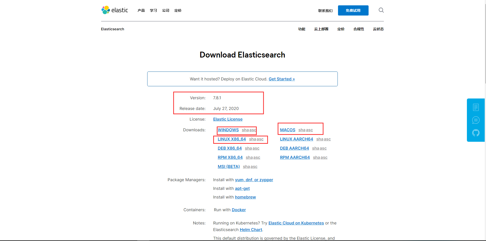

下载地址：https://www.elastic.co/cn/downloads/elasticsearch

>Windows下安装

1、解压就可以使用了！

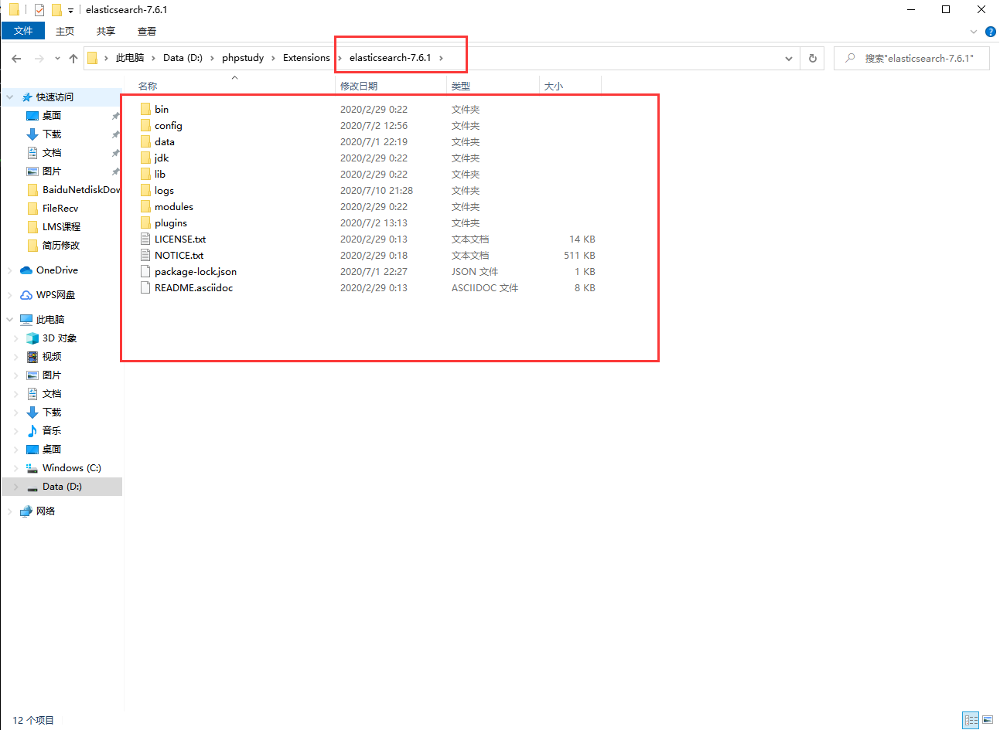

2、熟悉目录！

```
bin 启动文件
config 配置文件
    log4j2 日志配置文件
    jvm.options java 虚拟机相关的配置
    elasticsearch.yml elasticsearch 的配置文件！ 默认 9200 端口！ 跨域！
lib 相关jar包
logs 日志！
modules 功能模块
plugins 插件！
```

3、启动，访问9200；

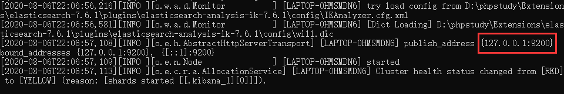

4、访问测试！


>安装可视化界面 es head的插件

1、下载地址：https://github.com/mobz/elasticsearch-head/

2. 启动

```
npm install
npm run start
```

3、连接测试发现，存在跨域问题：配置es

```
http.cors.enabled: true
http.cors.allow-origin: "*"
```

4、重启es服务器，然后再次连接

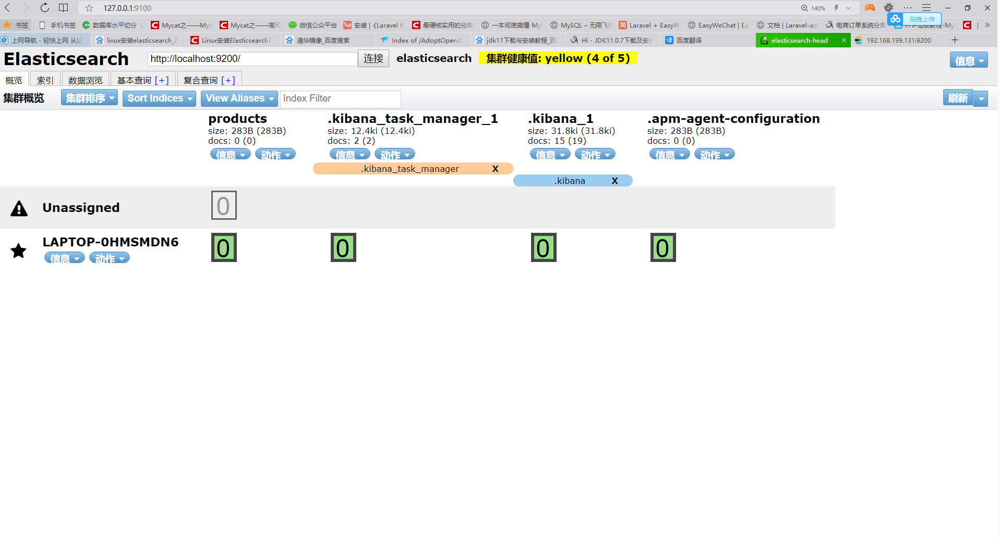

>linux下安装

1. 解压elasticsearch-7.6.1-linux-x86_64.tar.gz到/usr/local/目录：

```
tar -xvf elasticsearch-7.6.1-linux-x86_64.tar.gz
```

2. 进入解压后的elasticsearch目录：

（2）新建data
```
mkdir data
```

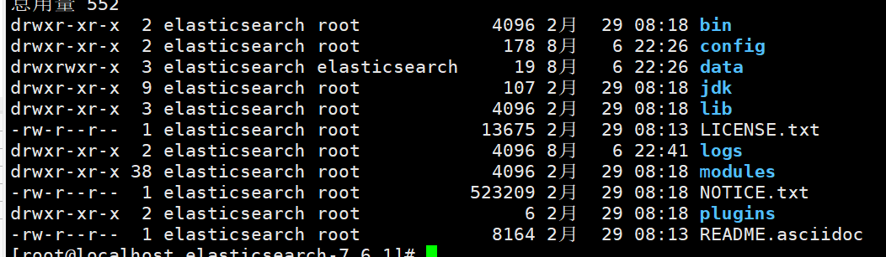

（2）修改config/elasticsearch.yml：

```
vi config/elasticsearch.yml
```

取消或者修改下列项注释并修改：

```yml
cluster.name: my-application #集群名称
node.name: node-1 #节点名称
#数据和日志的存储目录
path.data: /usr/local/elasticsearch-7.6.1/data
path.logs: /usr/local/elasticsearch-7.6.1/logs
#设置绑定的ip，设置为0.0.0.0以后就可以让任何计算机节点访问到了
network.host: 0.0.0.0
http.port: 9200 #端口
#设置在集群中的所有节点名称，这个节点名称就是之前所修改的，当然你也可以采用默认的也行，目前是单机，放入一个节点即可
cluster.initial_master_nodes: ["node-1"]
```

修改完毕后，:wq 保存退出vi

3. 准备启动es

进入/bin目录执行命令：
```
./elasticsearch
```

这里出现如下错误:

```
Java HotSpot(TM) 64-Bit Server VM warning: INFO: os::commit_memory(0x00000000c5330000, 986513408, 0) failed; error='Cannot allocate memory' (errno=12)
#
# There is insufficient memory for the Java Runtime Environment to continue.
# Native memory allocation (mmap) failed to map 986513408 bytes for committing reserved memory.
# An error report file with more information is saved as:
# logs/hs_err_pid22863.log
[root@localhost bin]#
```

elasticsearch使用java的jvm默认是使用1G的内存的，这里我们修改一下内存，直接把内存改到256m
cd 到es目录修改 ./config/jvm.options：

```
vi ./config/jvm.options
```

修改该内容：

```
-Xms256m
-Xmx256m
```

:wq 保存并退出vi，再次启动es

再次启动出现如下错误：
```
[2019-06-21T16:20:03,039][WARN ][o.e.b.ElasticsearchUncaughtExceptionHandler] [node-1] uncaught exception in thread [main]
org.elasticsearch.bootstrap.StartupException: java.lang.RuntimeException: can not run elasticsearch as root
at org.elasticsearch.bootstrap.Elasticsearch.init(Elasticsearch.java:163) ~[elasticsearch-7.6.1.jar:7.1.1]
at org.elasticsearch.bootstrap.Elasticsearch.execute(Elasticsearch.java:150) ~[elasticsearch-7.6.1.jar:7.1.1]
at org.elasticsearch.cli.EnvironmentAwareCommand.execute(EnvironmentAwareCommand.java:86) ~[elasticsearch-7.6.1.jar:7.1.1]
at org.elasticsearch.cli.Command.mainWithoutErrorHandling(Command.java:124) ~[elasticsearch-cli-7.1.1.jar:7.1.1]
at org.elasticsearch.cli.Command.main(Command.java:90) ~[elasticsearch-cli-7.1.1.jar:7.1.1]
at org.elasticsearch.bootstrap.Elasticsearch.main(Elasticsearch.java:115) ~[elasticsearch-7.6.1.jar:7.1.1]
at org.elasticsearch.bootstrap.Elasticsearch.main(Elasticsearch.java:92) ~[elasticsearch-7.6.1.jar:7.1.1]
Caused by: java.lang.RuntimeException: can not run elasticsearch as root
at org.elasticsearch.bootstrap.Bootstrap.initializeNatives(Bootstrap.java:102) ~[elasticsearch-7.6.1.jar:7.1.1]
at org.elasticsearch.bootstrap.Bootstrap.setup(Bootstrap.java:169) ~[elasticsearch-7.6.1.jar:7.1.1]
at org.elasticsearch.bootstrap.Bootstrap.init(Bootstrap.java:325) ~[elasticsearch-7.6.1.jar:7.1.1]
at org.elasticsearch.bootstrap.Elasticsearch.init(Elasticsearch.java:159) ~[elasticsearch-7.6.1.jar:7.1.1]
... 6 more
[root@localhost elasticsearch-7.6.1]#
```
这是不能使用root用户操作，添加一个其他的用户再试试：

```
[root@localhost elasticsearch-7.6.1]# useradd elasticsearch
[root@localhost elasticsearch-7.6.1]# passwd elasticsearch
更改用户 elasticsearch 的密码 。
新的 密码：
无效的密码： 密码少于 8 个字符
重新输入新的 密码：
passwd：所有的身份验证令牌已经成功更新。
[root@localhost elasticsearch-7.6.1]# chown -R elasticsearch /usr/local/elasticsearch-7.6.1
```

vi 编辑 /etc/security/limits.conf，在末尾加上：

```
elasticsearch soft nofile 65536
elasticsearch hard nofile 65536
elasticsearch soft nproc 4096
elasticsearch hard nproc 4096
```

vi 编辑 vi /etc/security/limits.d/20-nproc.conf，将* 改为用户名（elasticsearch）：

```
# Default limit for number of user's processes to prevent
# accidental fork bombs.
# See rhbz #432903 for reasoning.

elasticsearch          soft    nproc     4096
root       soft    nproc     unlimited
```

vi 编辑 /etc/sysctl.conf，在末尾加上：

```
vm.max_map_count = 655360
```

在root用户下执行:

```
[root@localhost ~]# sysctl -p
vm.max_map_count = 655360
[root@localhost ~]#
```
登录刚才新建的elasticsearch用户，并启动elasticsearch，OK

```
[root@localhost elasticsearch-7.6.1]# su es
[elasticsearch@localhost elasticsearch-7.6.1]$ ./bin/elasticsearch
```


>安装elasticsearch-head

1. 安装node.js

```
wget https://nodejs.org/dist/v12.18.1/node-v12.18.1-linux-x64.tar.xz    // 下载
tar xf node-v12.18.1-linux-x64.tar.xz                                   // 解压
cd node-v12.18.1-linux-x64                                              // 进入解压目录
解压文件的 bin 目录底下包含了 node、npm 等命令，我们可以修改linux系统的环境变量（profile）来设置直接运行命令：
export PATH=$PATH:/root/node-v12.18.1-linux-x64/bin
source /etc/profile
```

2. elasticsearch-head

```
1. 在/usr/local目录解压elasticsearch-head-master.zip
unzip elasticsearch-head-master.zip

2. 修改elasticsearch-head-master目录
mv elasticsearch-head-master elasticsearch-head

3. 在elasticsearch-head目录下安装npm
npm install  //安装后面可能会出现异常，但是不会影响操作

4. 启动elasticsearch-head
npm run start
```

成功后会出现跨域问题，在elasticsearch.yml配置文件中配置跨域：
```
http.cors.enabled: true # elasticsearch中启用CORS
http.cors.allow-origin: "*" # 允许访问的IP地址段，* 为所有IP都可以访问
```
再次访问，OK：


>kibana安装

```
1. 在/usr/local/解压kibana-7.6.1-linux-x86_64.tar.gz
tar -xvf kibana-7.6.1-linux-x86_64.tar.gz

2. 进入./kibana/config目录编辑kibana.yml文件
server.port: 5601
server.host: 0.0.0.0

3. 进入./kibana/bin目录启动
./kibana
Kibana should not be run as root.  Use --allow-root to continue.
不能在root用户下启动

4. 创建kibana用户

useradd kibana
passwd kibana
chown -R kibana /usr/local/kibana
```
进入kibana用户启动kibana访问，OK：


## 3. elasticsearch概念

| Relational DB    | Elasticsearch |
| ---------------- | ------------- |
| 数据库(database) | 索引(indices) |
| 表(tables)       | 类型(types)   |
| 行(rows)         | 文档(documents)|
| 字段(columns)    | 字段(fields)  |

elasticsearch(集群)中可以包含多个索引(数据库)，每个索引中可以包含多个类型(表)，每个类型下又包
含多 个文档(行)，每个文档中又包含多个字段(列)。

>物理设计

elasticsearch 在后台把每个索引划分成多个分片，每分分片可以在集群中的不同服务器间迁移
一个人就是一个集群！默认的集群名称就是 elaticsearh

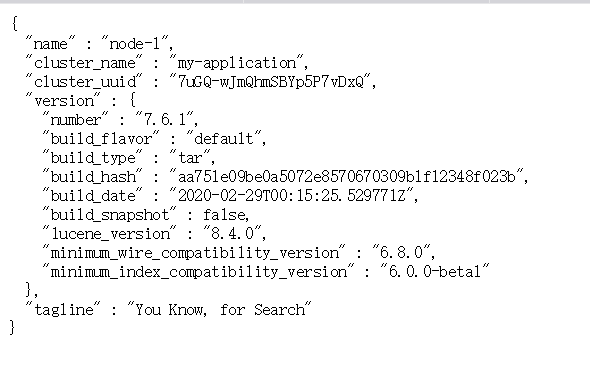

>逻辑设计

一个索引类型中，包含多个文档，比如说文档1，文档2。 当我们索引一篇文档时，可以通过这样的一各
顺序找到 它: 索引 ▷ 类型 ▷ 文档ID ，通过这个组合我们就能索引到某个具体的文档。 注意:ID不必是整
数，实际上它是个字 符串。

**文档**

就是我们的一条条数据

```
user
1 zhangsan 18
2 kuangshen 3
```

之前说elasticsearch是面向文档的，那么就意味着索引和搜索数据的最小单位是文档，elasticsearch
中，文档有几个 重要属性 :

* 自我包含，一篇文档同时包含字段和对应的值，也就是同时包含 key:value！
* 可以是层次型的，一个文档中包含自文档，复杂的逻辑实体就是这么来的！ {就是一个json对象！
fastjson进行自动转换！}
* 灵活的结构，文档不依赖预先定义的模式，我们知道关系型数据库中，要提前定义字段才能使用，
在elasticsearch中，对于字段是非常灵活的，有时候，我们可以忽略该字段，或者动态的添加一个
新的字段。

尽管我们可以随意的新增或者忽略某个字段，但是，每个字段的类型非常重要，比如一个年龄字段类
型，可以是字符 串也可以是整形。因为elasticsearch会保存字段和类型之间的映射及其他的设置。这种
映射具体到每个映射的每种类型，这也是为什么在elasticsearch中，类型有时候也称为映射类型。

>索引

就是数据库！

索引是映射类型的容器，elasticsearch中的索引是一个非常大的文档集合。索引存储了映射类型的字段
和其他设置。 然后它们被存储到了各个分片上了。 我们来研究下分片是如何工作的。

**物理设计 ：节点和分片 如何工作**


一个集群至少有一个节点，而一个节点就是一个elasricsearch进程，节点可以有多个索引默认的，如果
你创建索引，那么索引将会有个5个分片 ( primary shard ,又称主分片 ) 构成的，每一个主分片会有一个
副本 ( replica shard ,又称复制分片 )


上图是一个有3个节点的集群，可以看到主分片和对应的复制分片都不会在同一个节点内，这样有利于某
个节点挂掉 了，数据也不至于丢失。 实际上，一个分片是一个Lucene索引，一个包含倒排索引的文件
目录，倒排索引的结构使 得elasticsearch在不扫描全部文档的情况下，就能告诉你哪些文档包含特定的
关键字。 不过，等等，倒排索引是什 么鬼?

>**倒排索引**

elasticsearch使用的是一种称为倒排索引的结构，采用Lucene倒排索作为底层。这种结构适用于快速的
全文搜索， 一个索引由文档中所有不重复的列表构成，对于每一个词，都有一个包含它的文档列表。 例
如，现在有两个文档， 每个文档包含如下内容：

```
Study every day, good good up to forever # 文档1包含的内容
To forever, study every day, good good up # 文档2包含的内容
```

为了创建倒排索引，我们首先要将每个文档拆分成独立的词(或称为词条或者tokens)，然后创建一个包
含所有不重 复的词条的排序列表，然后列出每个词条出现在哪个文档 :

| term    | doc_1 | doc_2 |
| ------- | ----- | ----- |
| Study   | √     | x     |
| To      | x     | ×     |
| every   | √     | √     |
| forever | √     | √     |
| day     | √     | √     |
| study   | ×     | √     |
| good    | √     | √     |
| every   | √     | √     |
| to      | √     | ×     |
| up      | √     | √     |
|         |       |       |

现在，我们试图搜索 to forever，只需要查看包含每个词条的文档

| term    | doc_1 | doc_2 |
| ------- | ----- | ----- |
| to      | √     | ×     |
| forever | √     | √     |
| total   | 2     | 1     |

两个文档都匹配，但是第一个文档比第二个匹配程度更高。如果没有别的条件，现在，这两个包含关键
字的文档都将返回。

再来看一个示例，比如我们通过博客标签来搜索博客文章。那么倒排索引列表就是这样的一个结构 :


如果要搜索含有 python 标签的文章，那相对于查找所有原始数据而言，查找倒排索引后的数据将会快
的多。只需要 查看标签这一栏，然后获取相关的文章ID即可。完全过滤掉无关的所有数据，提高效率！

elasticsearch的索引和Lucene的索引对比

在elasticsearch中， 索引 （库）这个词被频繁使用，这就是术语的使用。 在elasticsearch中，索引被
分为多个分片，每份 分片是一个Lucene的索引。所以一个elasticsearch索引是由多个Lucene索引组成
的。别问为什么，谁让elasticsearch使用Lucene作为底层呢! 如无特指，说起索引都是指elasticsearch
的索引。

接下来的一切操作都在kibana中Dev Tools下的Console里完成。基础操作！

## 5. ik分词器

>ik分词器安装

    1. 在elasticsearch目录的plugins解压elasticsearch-analysis-ik-7.6.1.zip
    unzip elasticsearch-analysis-ik-7.6.1.zip
    
    2. 重新启动elasticsearch，elasticsearch-head，kibana
### 5.1 ik分词器介绍

**分词**:即把一段中文或者别的划分成一个个的关键字,我们在搜索时候会把自己的信息进行分词,会把数据库中或者索引库中的数据进行分词,然后进行一个匹配操作,默认的中文分词是将每个字看成一个词，比如：

"中国的花"会被分为"中","国","的","花",这显然是不符合要求的，所以我们需要安装中文分词器ik来解决这个问题

如果要使用中文，建议使用ik分词器！

IK提供了两个分词算法：ik_smart 和 ik_max_word，其中 ik_smart 为最少切分，ik_max_word为最细
粒度划分！一会我们测试！

1. elasticsearch-plugin 可以通过这个命令来查看加载进来的插件

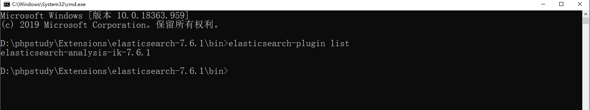

>ik_smart为最少切分

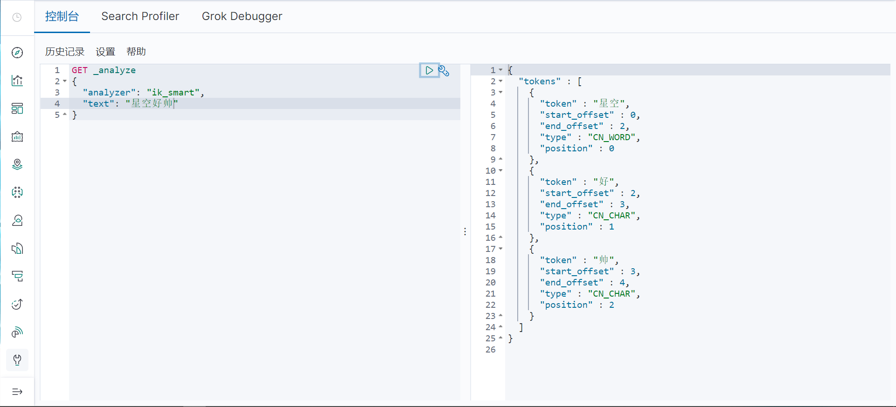

>ik_max_word为最细粒度划分！穷尽词库的可能！字典！

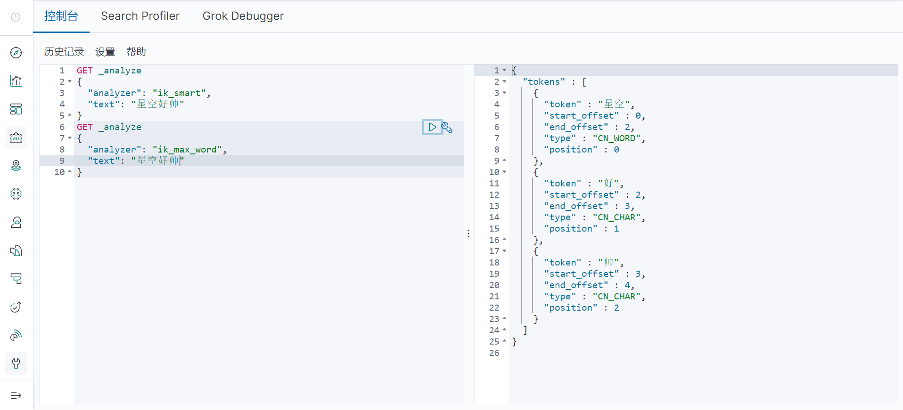

发现问题：好帅被拆开了！

这种自己需要的词，需要自己加到我们的分词器的字典中！

>ik 分词器增加自己的配置！

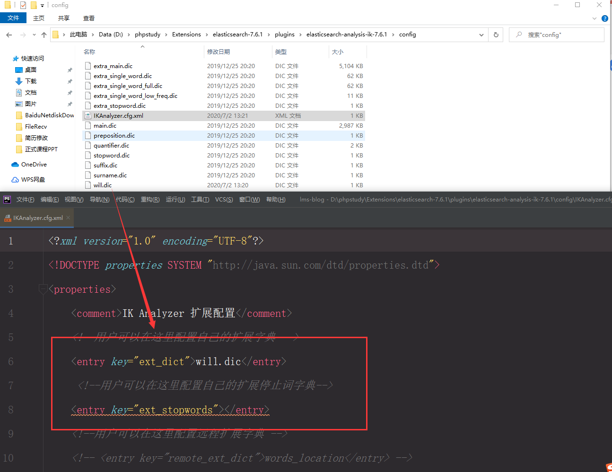

再次查看分词效果

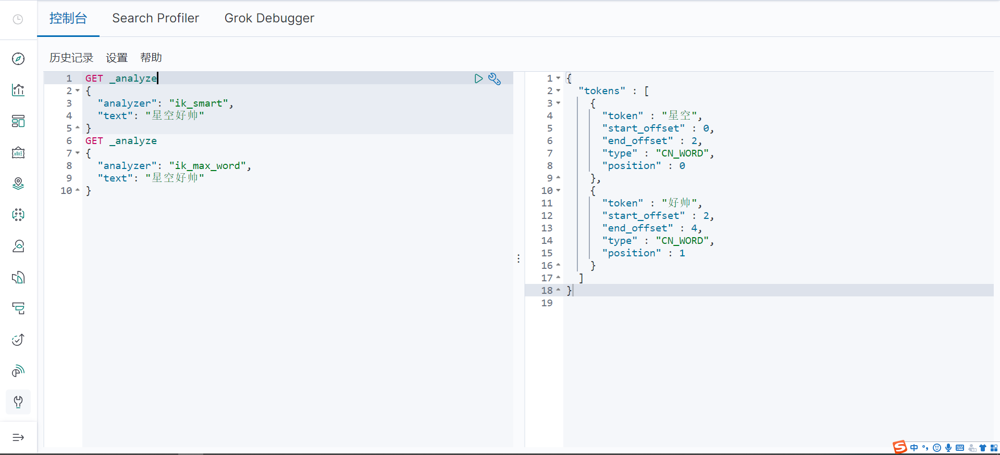

以后的话，我们需要自己配置 分词就在自己定义的dic文件中进行配置即可！

## 5. elasticsearch基本操作

一种软件架构风格，而不是标准，只是提供了一组设计原则和约束条件。它主要用于客户端和服务器交
互类的软件。基于这个风格设计的软件可以更简洁，更有层次，更易于实现缓存等机制。

基本Rest命令说明：

| method | url地址                                         | 描述                   |
| ------ | ----------------------------------------------- | ---------------------- |
| PUT    | localhost:9200/索引名称/类型名称/文档id         | 创建文档（指定文档id） |
| POST   | localhost:9200/索引名称/类型名称                | 创建文档（随机文档id） |
| POST   | localhost:9200/索引名称/类型名称/文档id/_update | 修改文档               |
| DELETE | localhost:9200/索引名称/类型名称/文档id         | 删除文档               |
| GET    | localhost:9200/索引名称/类型名称/文档id         | 查询文档通过文档id     |
| POST   | localhost:9200/索引名称/类型名称/_search        | 查询所有数据           |

>关于索引的基本操作

1、创建一个索引！

```
PUT /索引名/~类型名~/文档id
{请求体}
```

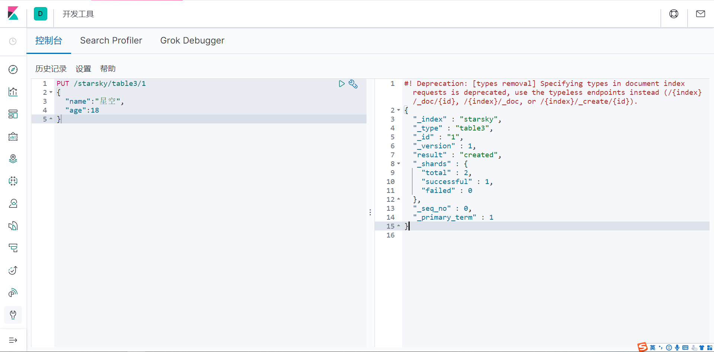

完成了自动增加了索引！数据也成功的添加了，这就是我说大家在初期可以把它当做数据库学习的原因！


2、那么 name 这个字段用不用指定类型呢。毕竟我们关系型数据库 是需要指定类型的啊 !

* 字符串类型
text 、 keyword
* 数值类型
long, integer, short, byte, double, float, half_float, scaled_float
* 日期类型
date
PUT /索引名/~类型名~/文档id {请求体}
* te布尔值类型
boolean
* 二进制类型
binary
* 等等

3. 指定字段的类型

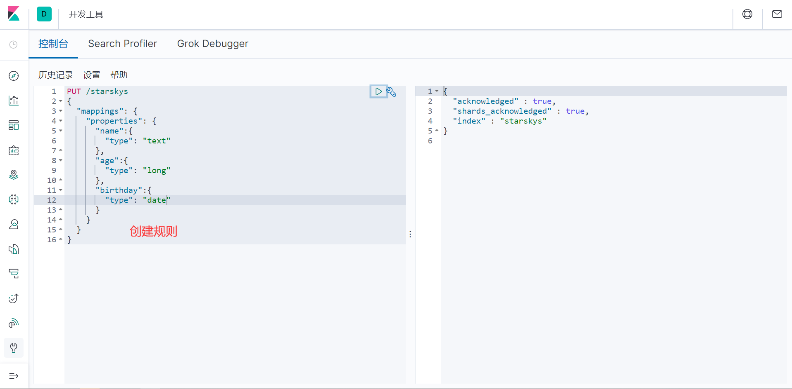

获得这个规则！ 可以通过 GET 请求获取具体的信息！

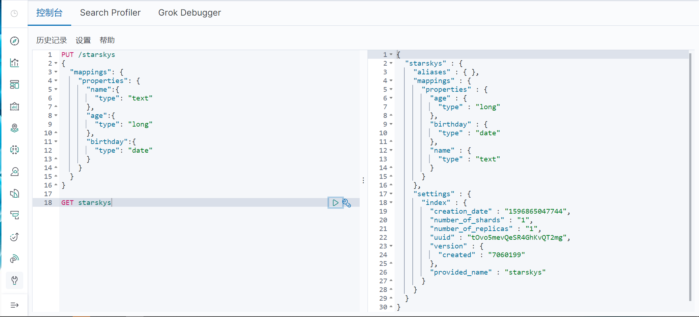

>扩展： 通过命令 elasticsearch 索引情况！ 通过get _cat/ 可以获得es的当前的很多信息！

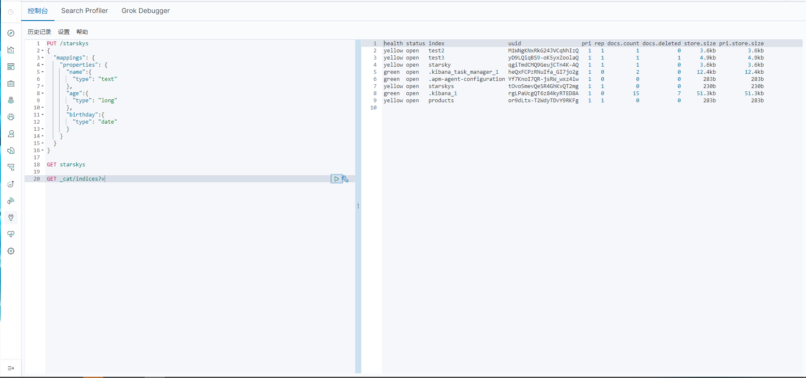

>修改 提交还是使用PUT 即可！ 然后覆盖！最新办法！

曾经！

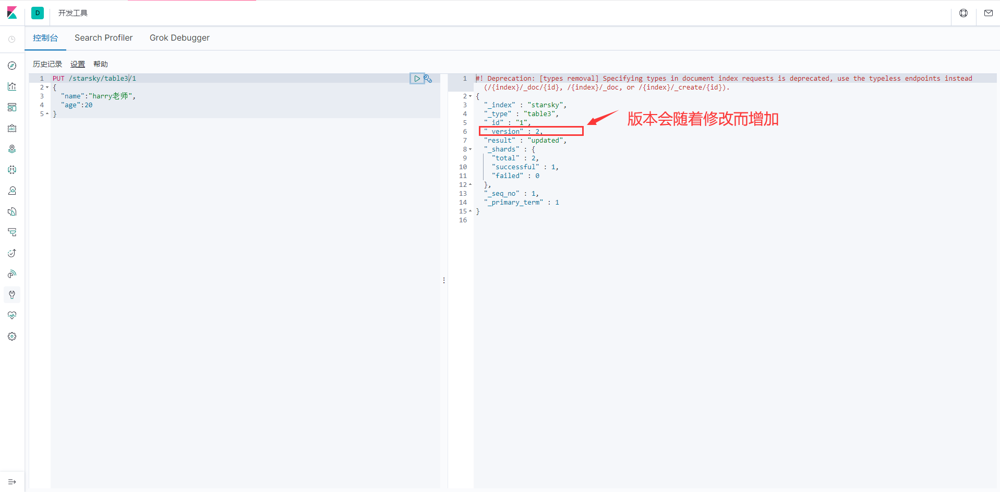

现在的方法！

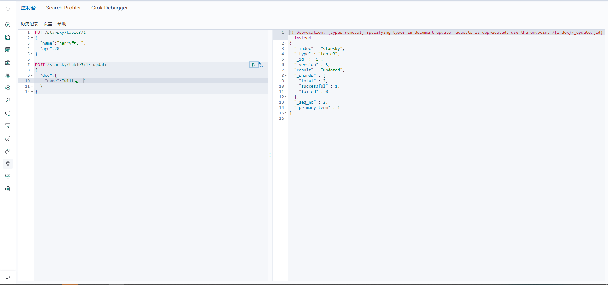

>删除索引！

通过DELETE 命令实现删除、 根据你的请求来判断是删除索引还是删除文档记录！

使用RESTFUL 风格是我们ES推荐大家使用的！
