# elasticsearch接入

## 课程内容

1. 多图上传与商品属性，商品长标题
2. elasticsearch同步商品表数据
3. 商品提交redis队列自动同步数据到elasticsearch
4. 队列后台进程运行

## 本节环境声明（本地或者是虚拟机都可以）

1. 安装好redis以及PHP的redis扩展
2. elasticsearch需要安装
3. Supervisor安装（只能是Linux，因为Supervisor 是 Linux 操作系统下中的一个进程监控器）

## 1. 多图上传与商品属性以及商品长标题

### 1.1 多图上传

在App/Admin/Controllers/ProductsController的form方法中添加：

```php
<?php
/**
 * Make a form builder.
 *
 * @return Form
 */
protected function form()
{
  ...

  $form->hasMany('images','商品图片设置',function (Form\NestedForm $form){
    $form->multipleImage('image_url','商品详情图片')
         ->sortable()
         ->removable()
         ->required()
         ->options([
           'dropZoneEnabled' => true, // 该参数允许拖拽上传
           'browseOnZoneClick' => true, // 该参数允许点击上传
           'slugCallback' => false, // 该参数是重新选择后依旧保留之前的，并且不会重复显示
           'uploadUrl' => '#', // 异步上传
           'showUpload' => false, // 是否显示上传按钮
           'layoutTemplates' => ['actionUpload' => ''], // 该参数要与uploadUrl结合使用，目的 为了不是异步上传的，但是能删掉多张图片中的某一张
           'maxFileCount' => 5, // 该参数是最多只能选择多少张
       ]);
   });

  ...
}
?>
```

在ProductImage模型中需要对新增与查询的数据进行设置：

```php
<?php
public function getImageUrlAttribute($value)
{
  return json_decode($value,true);
}

public function setImageUrlAttribute($image)
{
  if (is_array($image)) {
    $this->attributes['image_url'] = json_encode($image);
  }
}
?>
```

然后在laravel-admin中进行访问：

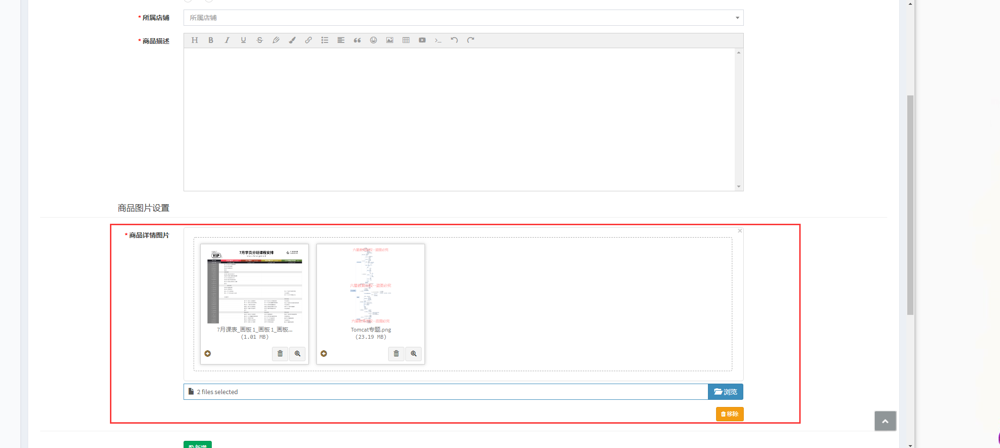

**注意此处因为laravel-admin组件存在bug，新增的数据只能获取到一张图片**

### 1.2 商品属性

商品属性是一组结构化的数据，用键值对的方式将商品的一系列特征展示给用户，如下图：

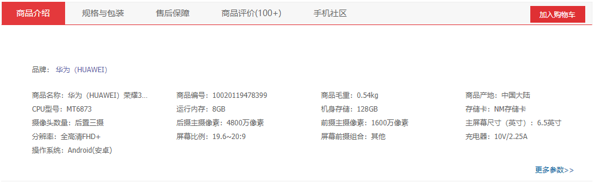

这样可以让用户更容易了解该商品的一些数据，同时也可以通过这些属性来搜索、筛选商品

>商品属性表

| 字段名称   | 描述      | 类型                   |
| ---------- | --------- | ---------------------- |
| id         | 自增长 ID | unsigned big int       |
| product_id | 商品 ID   | unsigned big int, null |
| name       | 属性名称  | varchar                |
| value      | 属性值    | varchar                |


1. 接下来我们创建商品属性的模型

```
php artisan make:model Models/ProductProperty
```

调整模型代码：

```php
<?php

namespace App\Models;

use Illuminate\Database\Eloquent\Model;

class ProductProperty extends Model
{
    protected $fillable = ['name', 'value'];
    // 没有 created_at 和 updated_at 字段
    public $timestamps = false;

    public function product()
    {
        return $this->belongsTo(Product::class);
    }
}
?>
```

以及在 Product 模型中加入关联关系：

```php
<?php
public function properties()
{
    return $this->hasMany(ProductProperty::class);
}
?>
```

2. 调整商品后台

接下来我们需要在商品的管理后台加上商品属性相关的表单，由于商品属性是一个不同类型商品都通用的参数，因此需要在 ProductsController 的form中添加：

```php
<?php
public function form
{
  ...
    // 放在 SKU 下面
  $form->hasMany('properties', '商品属性', function (Form\NestedForm $form) {
      $form->text('name', '属性名')->rules('required');
      $form->text('value', '属性值')->rules('required');
  });
  ...
}
?>
```

接下来我们测试一下后台，直接访问 http://blog-shop.com/admin/products/create，按照下面图片里的字段创建一个普通商品：

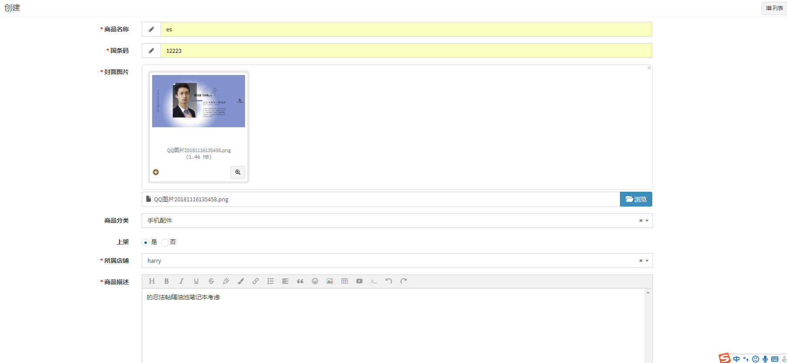

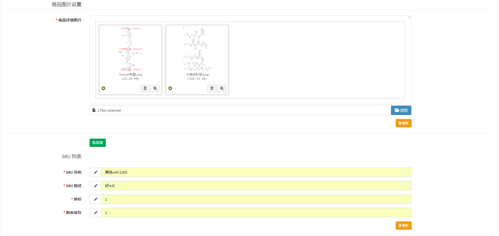

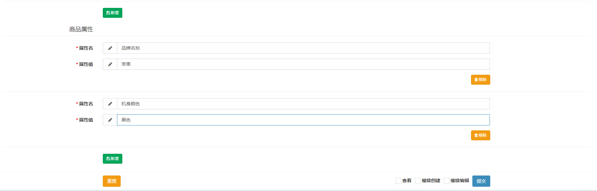

可以看到在 『商品 SKU』 的表单后面跟着『商品属性』的表单。

### 1.3 商品长标题

商品标题是电商系统搜索引擎一个权重很高的字段，为了使商品能够更容易被搜索出来，往往会在商品标题里添加很多关键字。

但是电商网站为了页面样式能够统一，商品列表页面所能展示的字符数量通常会有所限制，不会超过两行，比如：

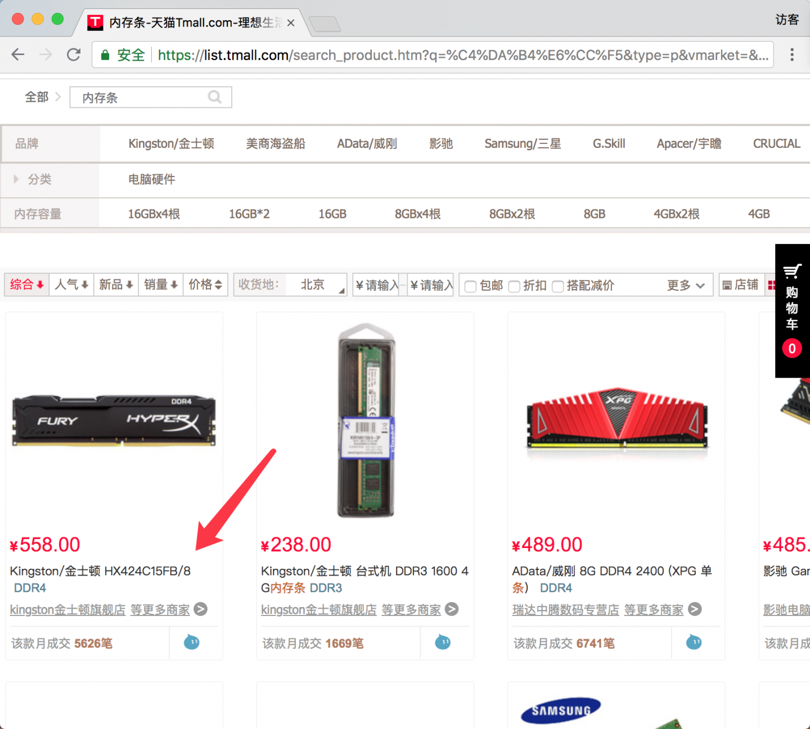

为了解决这个问题，电商网站通常都会引入一个商品长标题的字段，在商品列表页面展示短标题，在详情页面展示长标题，比如刚刚那个商品的详情页：

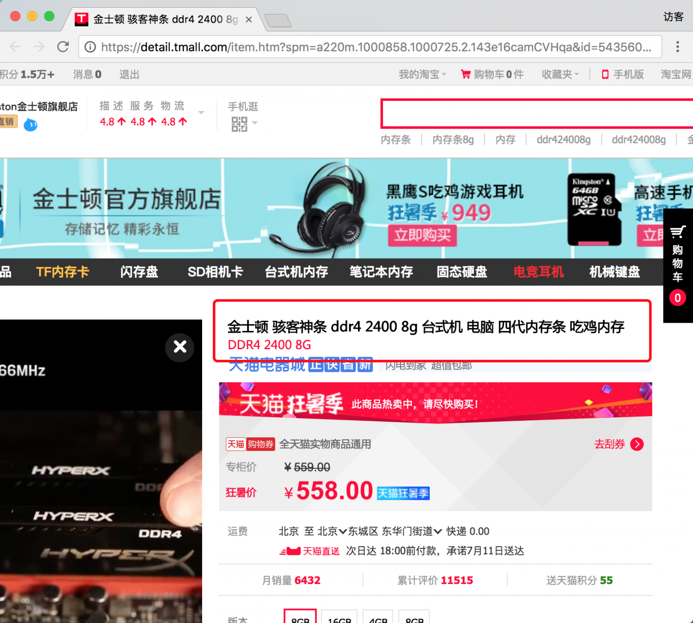

同时长标题的搜索权重略低于短标题但要高于商品描述。

本节将要在我们原本的商品表里添加一个长标题字段，为之后的搜索模块做准备。

## 2. elasticsearch同步商品表数据

### 2.1 在laravel中使用elasticsearch

1. 引入composer包
Elasticsearch 官方提供了 Composer 包，在引入时需要注意要指定版本，因为不同版本的 Elasticsearch 的 API 略有不同，我们用的是 7.x，因此需使用 ~7.0 来指定包版本。

```
composer require elasticsearch/elasticsearch '7.6.1'
```

>为什么不用 Scout？

```
熟悉 Laravel 的同学，应该会有此疑问。Scout 是 Laravel 官方出的一个让 Eloquent 模型支持全文搜索的包，这个包封装好一批方法，通过这些方法就可以将数据索引到全文搜索引擎中、以及使用关键字从搜索引擎搜索文档。这个包适用于一些简单的搜索场景，比如博客文章搜索，但无法发挥出全文搜索引擎全部威力，像 Elasticsearch 这种重量级的搜索引擎有无数种查询语句，例如 我们将会学到的 should 语句、模糊查询、分片查询等，根本不是 Scout 几个简单的方法能够覆盖的，也就无法满足电商系统搜索模块的需求。
```

2. 配置
Elasticsearch 的配置很简单，我们只需要 Elasticsearch 服务器的 IP 和端口即可：

config/database.php
```
'elasticsearch' => [
    // Elasticsearch 支持多台服务器负载均衡，因此这里是一个数组
    'hosts' => explode(',', env('ES_HOSTS')),
]
```

我们本地环境的 Elasticsearch 的 IP 和端口是 localhost:9200，如果端口是 9200 则可以忽略不写

.env
```
ES_HOSTS=localhost
```

3. 初始化elasticsearch对象

接下来我们将初始化 Elasticsearch 对象，并注入到 Laravel 容器中：
app/Providers/AppServiceProvider.php
```
use Elasticsearch\ClientBuilder as ESClientBuilder;
.
.
.
    public function register()
    {
        .
        .
        .
        // 注册一个名为 es 的单例
        $this->app->singleton('es', function () {
            // 从配置文件读取 Elasticsearch 服务器列表
            $builder = ESClientBuilder::create()->setHosts(config('database.elasticsearch.hosts'));
            // 如果是开发环境
            if (app()->environment() === 'local') {
                // 配置日志，Elasticsearch 的请求和返回数据将打印到日志文件中，方便我们调试
                $builder->setLogger(app('log')->driver());
            }

            return $builder->build();
        });
    }
.
.
.
```

4. 测试

接下来我们来测试一下能否正常工作，首先进入 tinker：

```
php artisan tinker
```
然后输入：
```
>>>app('es')->info()
```


### 1.2 elasticsearch同步商品表数据

#### 1.2.1 创建商品索引与定义商品字段

>1. 创建索引

现在我们需要重新创建一个 Elasticsearch 索引用于保存商品数据，名为 products：

```
curl -XPUT http://localhost:9200/products?pretty   或者   curl -XPUT http://你的服务器ip:9200/products?pretty
```

>2. 定义商品字段

```json
PUT /products/_mapping?pretty
{
    "properties": {
    "type": { "type": "keyword" } ,
    "product_core": { "type": "text"},
    "title": { "type": "text", "analyzer": "ik_smart" },
    "bar_code": { "type": "text"},
    "category": { "type": "keyword" },
    "category_path":{"type": "keyword"},
    "status": { "type": "boolean" },
    "audit_status": { "type": "integer" },
    "shop_name": { "type": "text","analyzer": "ik_smart" },
    "description": { "type": "text", "analyzer": "ik_smart" },
    "rating": { "type": "float" },
    "sold_count": { "type": "integer" },
    "review_count": { "type": "integer" },
    "price":{"type": "scaled_float", "scaling_factor": 100},
    "image":{"type":"text"},
    "skus": {
      "type": "nested",
      "properties": {
        "title": { "type": "text", "analyzer": "ik_smart" },
        "description": { "type": "text", "analyzer": "ik_smart" },
        "price": { "type": "scaled_float", "scaling_factor": 100 }
      }
    },
    "properties": {
      "type": "nested",
      "properties": {
        "name": { "type": "keyword" },
        "value": { "type": "keyword" }
      }
    }
  }
}
```

"analyzer": "ik_smart" 代表这个字段需要使用 IK 中文分词器分词，在前面的章节也介绍过了。

还有有一些字段的类型是 keyword，这是字符串类型的一种，这种类型是告诉 Elasticsearch 不需要对这个字段做分词，通常用于邮箱、标签、属性等字段。

scaled_float 代表一个小数位固定的浮点型字段，与 Mysql 的 decimal 类型类似，后面的 scaling_factor 用来指定小数位精度，100 就代表精确到小数点后两位。

skus 和 properties 的字段类型是 nested，代表这个字段是一个复杂对象，由下一级的 properties 字段定义这个对象的字段。有同学可能会问，我们的『商品 SKU』和『商品属性』明明是对象数组，为什么这里可以定义成对象？这是 Elasticsearch 的另外一个特性，每个字段都可以保存多个值，这也是 Elasticsearch 的类型没有数组的原因，因为不需要，每个字段都可以是数组。

**请确保 Elasticsearch 返回了 "acknowledged" : true，否则就要检查提交的内容是否有问题。**

在kibana中查询创建的字段：

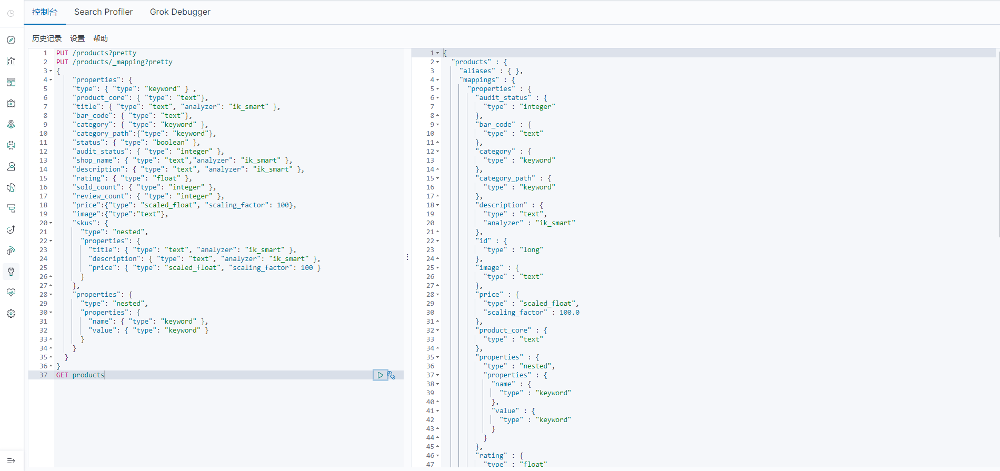

>3. 转化商品模型为数组,为之后的同步代码提供数据

接下来我们试着将一条商品数据写入到 Elasticsearch，需要写一个方法把商品模型转成符合上述字段格式的数组：

app\Models\Product

```php
<?php
use Illuminate\Support\Arr;
.
.
.
    public function toESArray()
    {
      // 只取出需要的字段
      $arr = Arr::only($this->toArray(), [
        'id',
        'product_core',
        'title',
        'bar_code',
        'status',
        'audit_status',
        'rating',
        'sold_count',
        'review_count',
        'price',
        'image'
      ]);

      // 如果商品有类目，则 category 字段为类目名数组，否则为空字符串
      $arr['category'] = $this->category ? explode(' - ', $this->category->full_name) : '';
      // 类目的 path 字段
      $arr['category_path'] = $this->category ? $this->category->path : '';
      // strip_tags 函数可以将 html 标签去除
      $arr['description'] = strip_tags($this->productdescriptions["description"]);
      // 只取出需要的 SKU 字段
      $arr['skus'] = $this->skus->map(function (ProductSku $sku) {
          return Arr::only($sku->toArray(), ['title', 'description', 'price']);
      });
      $arr['shop_name'] = $this->shop->name;
      // 只取出需要的商品属性字段
      $arr['properties'] = $this->properties->map(function (ProductProperty $property) {
          return Arr::only($property->toArray(), ['name', 'value']);
      });

      return $arr;
    }
.
.
.
?>
```

在上面代码中 category 字段的值可能是数组也可能是字符串，Elasticsearch 都支持，这就是我们上面说的，任何一个字段都可以存多个值。我们这里把商品的类目及对应的祖先类目都存到了这个字段中，这样当用户搜索任意一个祖先类目时都可以匹配到这个商品。

>4. 测试-将商品加入elasticsearch

    $arr=App\Models\Product::find(86)->toESArray();
    app('es')->index(['id'=>$arr['id'],'index'=>'products','body'=>$arr]);
    app('es')->get(['index'=>'products','id'=>86])
    
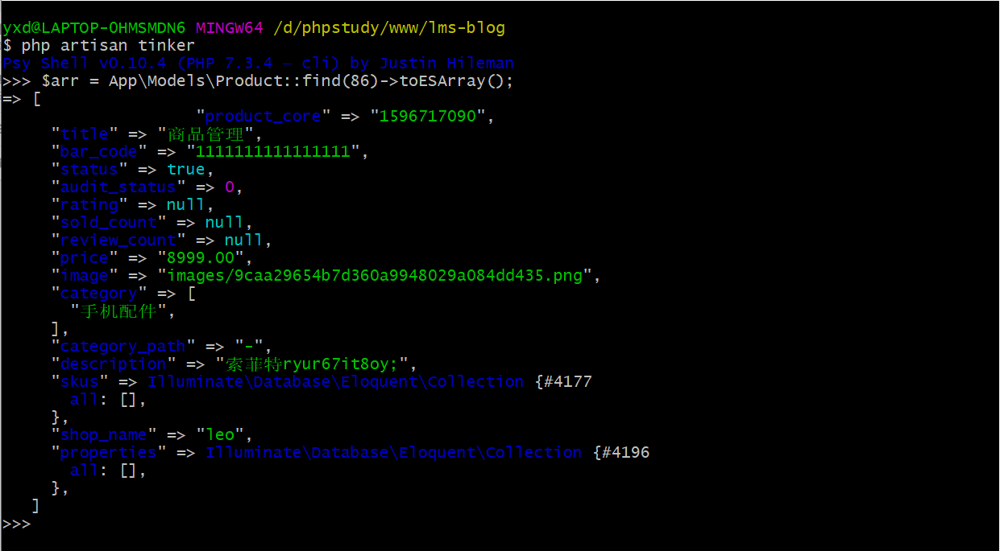

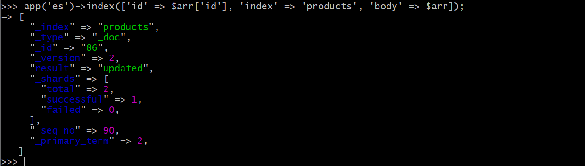

接下来我们试着读取一下，看看是否正确：

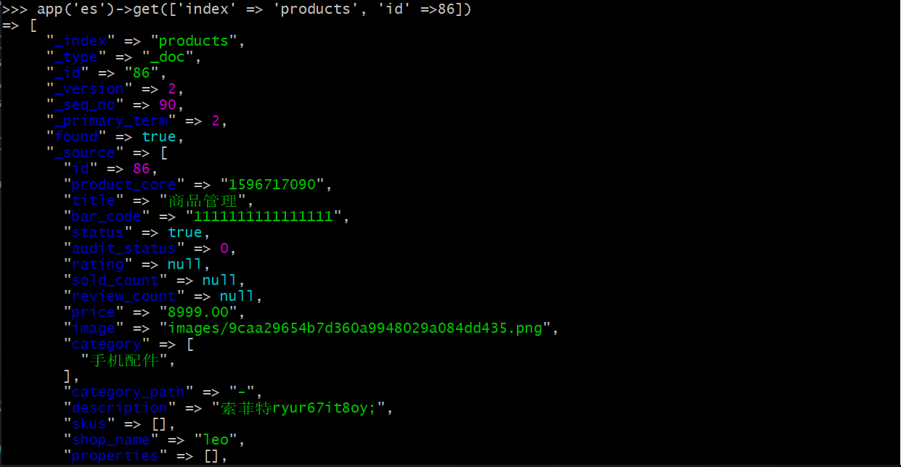

可以看到 category、skus 和 properties 返回的都是数组，与我们写入时的数据一致。

>5. 同步数据

首先我们需要把系统中已有的商品数据同步到 Elasticsearch 中，可以创建一个 Artisan 命令来实现：

```
php artisan make:command Elasticsearch/SyncProducts
```

```php
<?php
<?php
namespace App\Console\Commands\Elasticsearch;

use App\Models\Product;
use Illuminate\Console\Command;

class SyncProducts extends Command
{
    protected $signature = 'es:sync-products';

    protected $description = '将商品数据同步到 Elasticsearch';

    public function __construct()
    {
        parent::__construct();
    }

    public function handle()
    {
        // 获取 Elasticsearch 对象
        $es = app('es');

        Product::query()
            // 预加载 SKU 和 商品属性数据，避免 N + 1 问题
            ->with(['skus', 'properties'])
            // 使用 chunkById 避免一次性加载过多数据
            ->chunkById(100, function ($products) use ($es) {
                $this->info(sprintf('正在同步 ID 范围为 %s 至 %s 的商品', $products->first()->id, $products->last()->id));

                // 初始化请求体
                $req = ['body' => []];
                // 遍历商品
                foreach ($products as $product) {
                    // 将商品模型转为 Elasticsearch 所用的数组
                    $data = $product->toESArray();

                    $req['body'][] = [
                        'index' => [
                            '_index' => 'products',
                            '_type'  => '_doc',
                            '_id'    => $data['id'],
                        ],
                    ];
                    $req['body'][] = $data;
                }
                try {
                    // 使用 bulk 方法批量创建
                    $es->bulk($req);
                } catch (\Exception $e) {
                    $this->error($e->getMessage());
                }
            });
        $this->info('同步完成');
    }
}
?>
```

这里使用了 chunkById() 方法避免一次性加载过多的商品数据，具体原理在之前的章节已经给大家介绍过了，这里不再多说。

我们在写入商品数据的时候用的是 bulk() 方法，这是 Elasticsearch 提供的一个批量操作接口。设想一下假如我们系统里有数百万条商品，如果每条商品都单独请求一次 Elasticsearch 的 API，那就是数百万次的请求，性能肯定是很差的，而 bulk() 方法可以让我们用一次 API 请求完成一批操作，从而减少请求次数的数量级，提高整体性能。

bulk() 方法的参数是一个数组，数组的第一行描述了我们要做的操作，第二行则代表这个操作所需要的数据，第三行操作描述，第四行数据，依次类推，当然如果是删除操作则没有数据行。我们这个代码里只有创建数据，因此都是每两行一组操作。

>6. 测试数据同步

现在我们来执行一下这个命令：

```
 php artisan es:sync-products
```

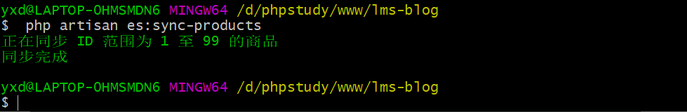

现在我们来看看 Elasticsearch 索引中有多少条数据，可以通过 /{index_name}/_doc/_count 这个接口来查询：

```
curl http://localhost:9200/products/_doc/_count?pretty
```

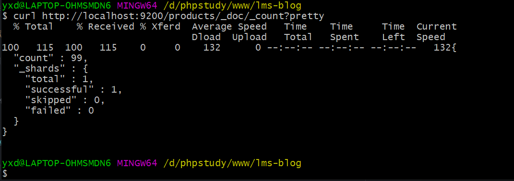

## 3. 商品提交redis队列同步变更数据到elasticsearch

接下来我们要实现新增或者修改商品时，能够同步到 Elasticsearch。

我们可以用一个异步任务来实现这个需求：

```
php artisan make:job SyncOneProductToES
```

这个异步任务的代码和我们上一节在 tinker 中执行的差不多：

app/Jobs/SyncOneProductToES.php
```php
<?php

namespace App\Jobs;

use App\Models\Product;
use Illuminate\Bus\Queueable;
use Illuminate\Queue\SerializesModels;
use Illuminate\Queue\InteractsWithQueue;
use Illuminate\Contracts\Queue\ShouldQueue;
use Illuminate\Foundation\Bus\Dispatchable;

// ShouldQueue 代表异步
class SyncOneProductToES implements ShouldQueue
{
    use Dispatchable, InteractsWithQueue, Queueable, SerializesModels;

    protected $product;

    public function __construct(Product $product)
    {
        $this->product = $product;
    }

    public function handle()
    {
        $data = $this->product->toESArray();
        app('es')->index([
            'index' => 'products',
            'type'  => '_doc',
            'id'    => $data['id'],
            'body'  => $data,
        ]);
    }
}
?>
```
接下来我们需要在合适的地方触发这个异步任务。

我们可以在 Laravel-Admin 的表单回调中来触发，当运营人员提交商品表单时，Laravel-Admin 就会触发表单回调，我们之前计算商品价格时用的是表单的 saving 事件，这次我们需要用 saved 事件，由于我们希望所有类型的商品在被创建或者被修改时都能同步到 Elasticsearch，所有我们把这个逻辑写在 CommonProductsController 中：

app/Admin/Controllers/ProductsController.php
```php
<?php
use App\Jobs\SyncOneProductToES;
.
.
.
    protected function form()
    {
        .
        .
        .
        $form->saved(function (Form $form) {
            $product = $form->model();
            dispatch(new SyncOneProductToES($product));
        });

        return $form;
    }
.
.
.
?>
```

启动队列处理器：
```
php artisan queue:work
```

关于laravel的队列可以看这里：https://learnku.com/docs/laravel/6.x/queues/5168#running-the-queue-worker

## 4. 队列后台进程运行
