# es花式查询与搜索

## 课程内容

1. 数据同步后台进程
2. es花式查询
3. 商品列表

## 1. 数据同步后台进程

『Horizon』是 Laravel 官方推出的一个集成在 Laravel 项目中的 Redis 队列管理工具，包含了一个可视化面板和几个管理命令，可以让我们更加方便地管理异步任务。

我们可以通过 composer 直接安装：

```
composer require laravel/horizon "3.7.2"
```

安装完成之后还需要把 Horizon 的配置文件和前端文件放到项目目录中：

```
php artisan vendor:publish --provider="Laravel\Horizon\HorizonServiceProvider"
```

现在我们访问 http://blog-shop.com/horizon 看看 Horizon 的管理面板,初始的状态是 Inactive，我们需要在终端调用 Horizon 的命令来启动：

```
php artisan horizon
```
现在刷新页面看看：

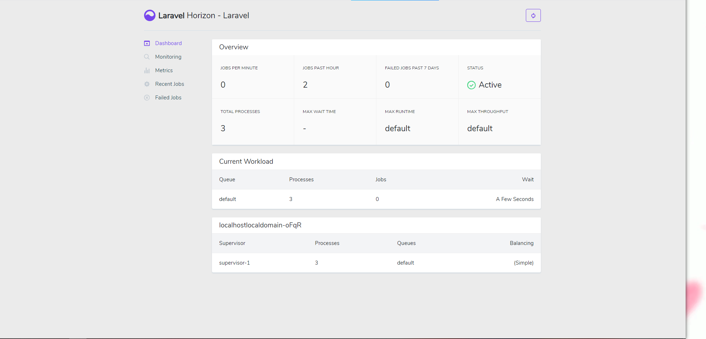

可以看到 状态已经变成了 Active

现在我们到管理后台任意找一个商品进入编辑页面然后保存，使之触发一个异步任务，然后看看终端：


可以看到这个命令和 queue:work 一样能够正常处理异步任务。现在再到 Horizon 的管理页面看看：

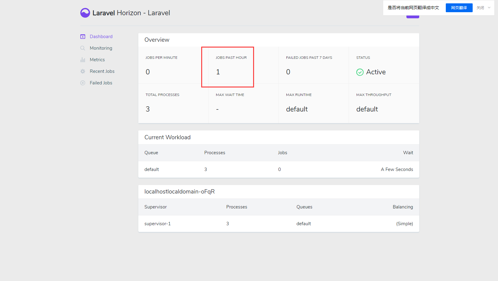

>服务器配置队列

Supervisor 是一款进程管理工具，通过配置可以实现自动监听进程状态，如果被监听的进程发生异常退出，Supervisor 会尝试再次启动该进程。我们可以通过以下方式进行安装：
```
yum install -y supervisor
systemctl enable supervisord  # 开机自启动
systemctl start supervisord  # 启动supervisord服务
systemctl status supervisord # 查看supervisord服务状态
```

安装好了 Supervisor，现在来创建一个 Supervisor 配置

```
$ vi /etc/supervisor/conf.d/laravel-shop.conf

内容如下：
[program:laravel-shop-horizon]
process_name=%(program_name)s
command=php /www/wwwroot/lms/blog/artisan horizon
autostart=true
autorestart=true
user=root
redirect_stderr=true
stdout_logfile=/www/wwwroot/lms/blog/storage/logs/worker.log
```

* program:laravel-shop-horizon 代表这个配置的名称是 laravel-shop-horizon；
* process_name= 代表这个进程在 Supervisor 内部的命名；
* command= 代表要执行的命令；
* autostart=true 代表这个进程跟随 Supervisor，只要 Supervisor 启动了，就启动这个进程；
* autorestart=true 代表要求 Supervisor 监听进程状态，假如异常退出就再次启动；
* user=www-data 代表以 www-data 身份启动进程；
* redirect_stderr=true 代表输出错误信息；
* stdout_logfile= 代表将进程的输出保存到日志文件中。

接下来我们需要让 Supervisor 重新加载配置：

```
supervisorctl update
supervisorctl status # 重新加载配置之后在次查看Supervisor服务状态
```

## 2. es花式查询

### 2.1 基本查询

1. 添加数据 PUT

```
PUT /starsky/user/1
{
  "name":"星空",
  "age":"20",
  "sex":"男"
}
```

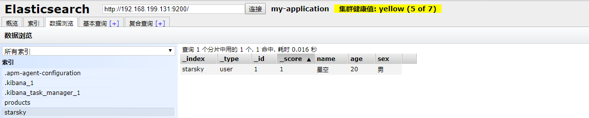

2. 获取数据 GET

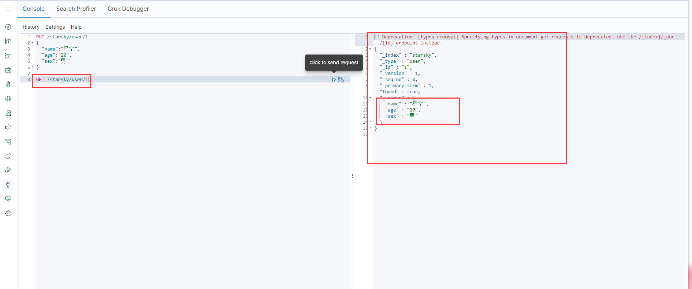

3. 修改数据 PUT

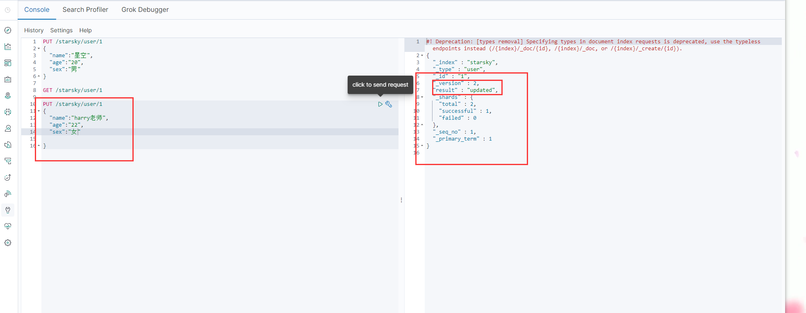

4. Post _update , 推荐使用这种更新方式！

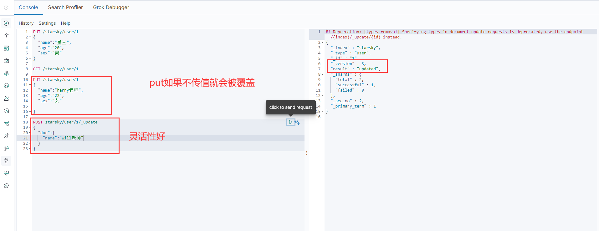

简单地搜索！

```
GET starsky/user/1
```

简答的条件查询，可以根据默认的映射规则，产生基本的查询！

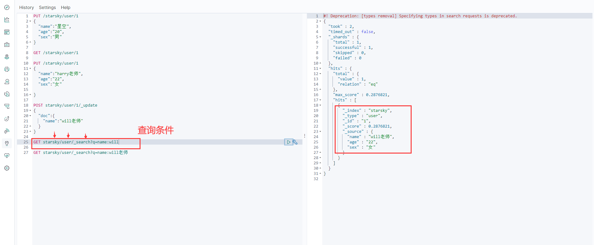

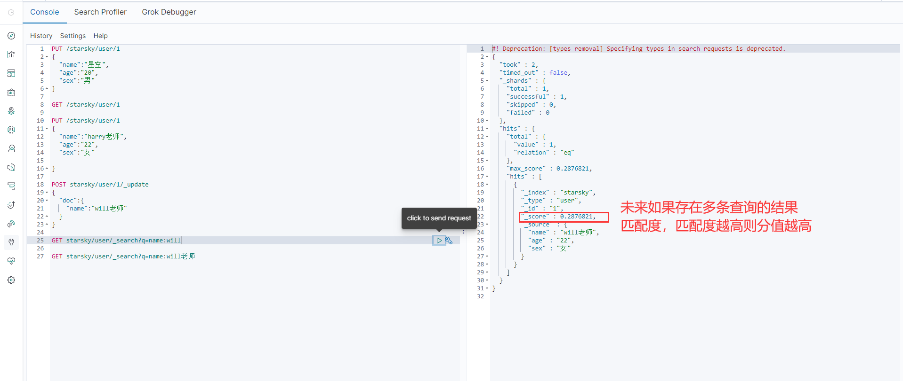

### 2.2 复杂操作搜索 select ( 排序，分页，高亮，模糊查询，精准查询！)

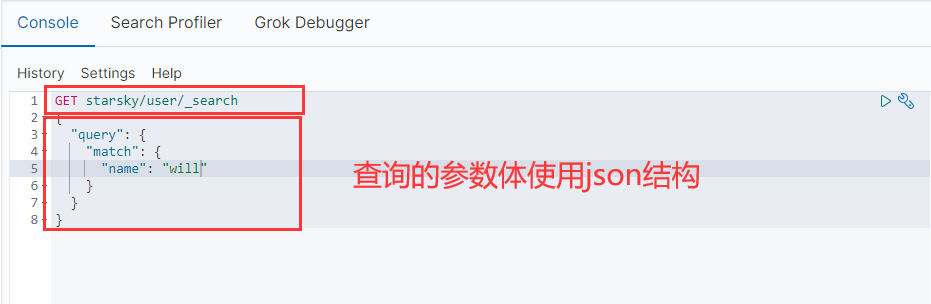

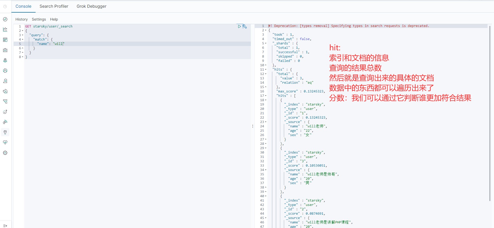

输出结果，不想要那么多！

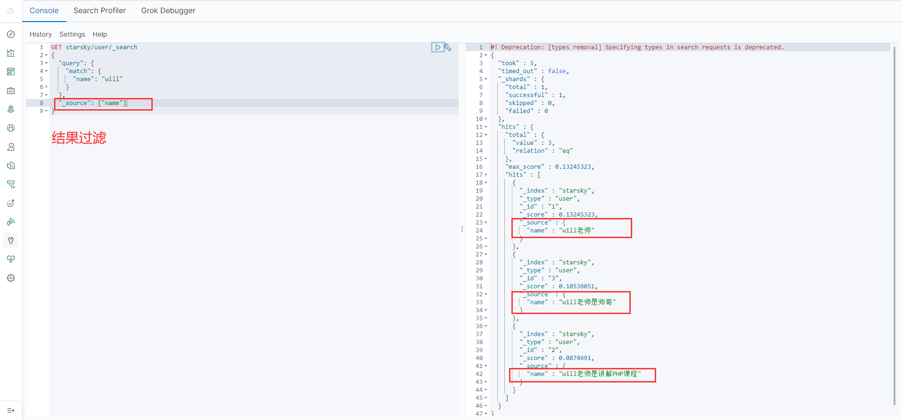

>1. 排序

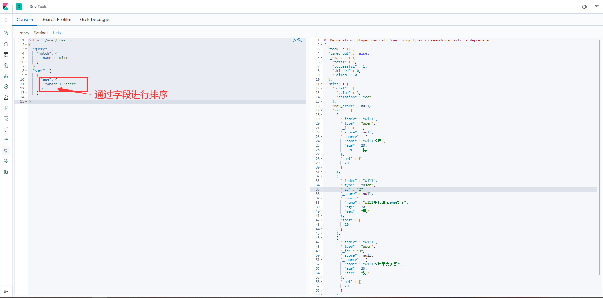

>2. 分页查询

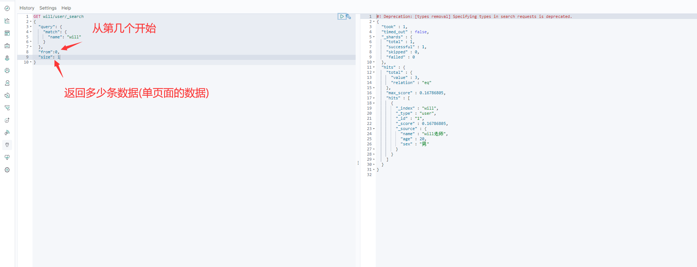

数据下标还是从0开始的，和学的所有数据结构是一样的！
/search/{current}/{pagesize}

>3. 布尔值查询

must （and），所有的条件都要符合 where id = 1 and name = xxx

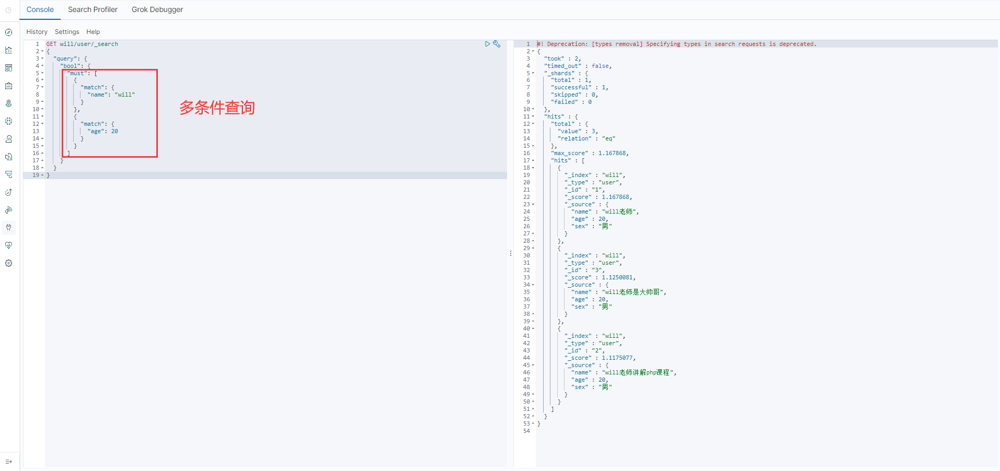

should（or），所有的条件都要符合 where id = 1 or name = xxx

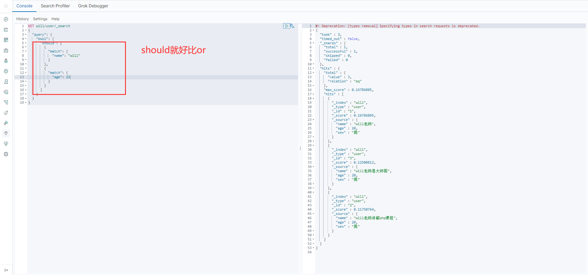

must_not （not）

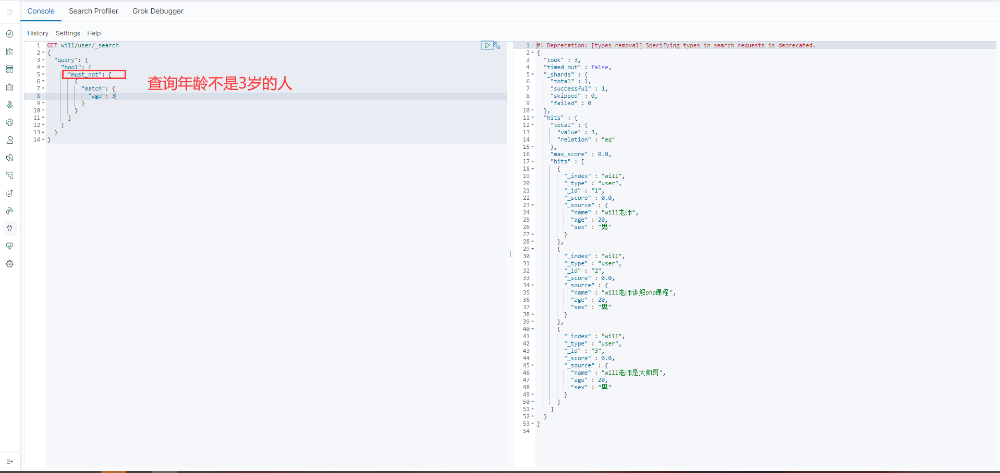

过滤器 filter

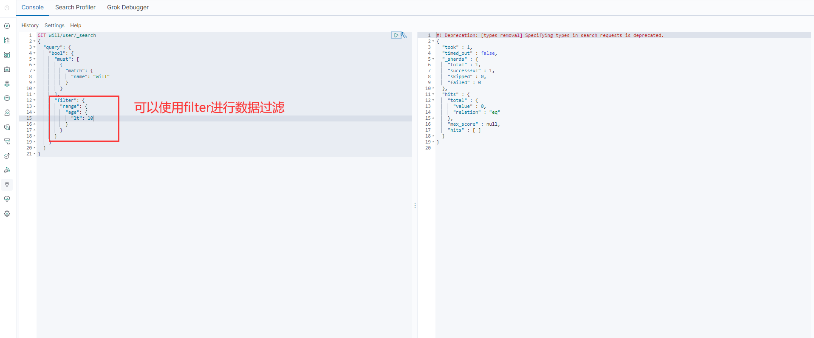

* gt 大于
* gte 大于等于
* lt 小于
* lte 小于等于！

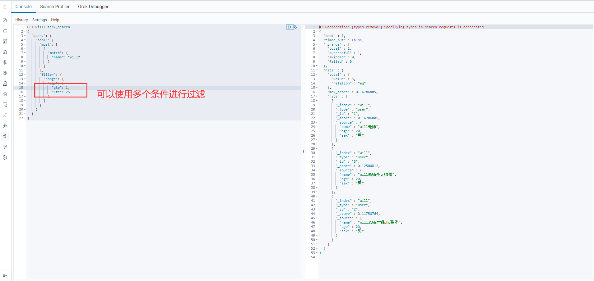

>4. 匹配多个条件

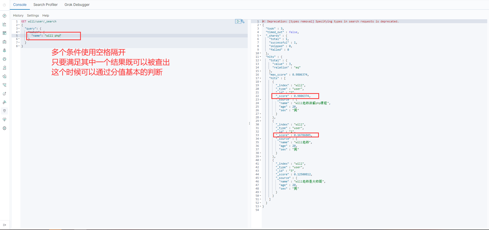

>5. 精准查询

term 查询是直接通过倒排索引指定的词条进程精确查找的！

关于分词：
* term ，直接查询精确的
* match，会使用分词器解析！（先分析文档，然后在通过分析的文档进行查询！）

两个类型 text keyword

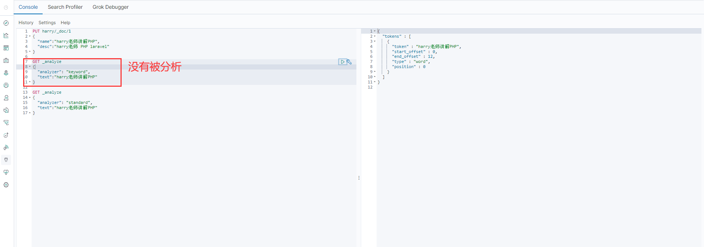

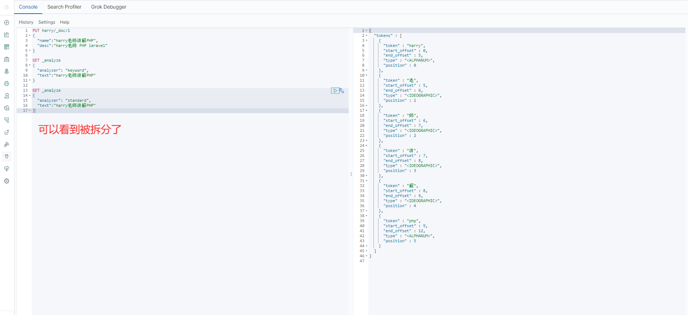

>6. 高亮查询

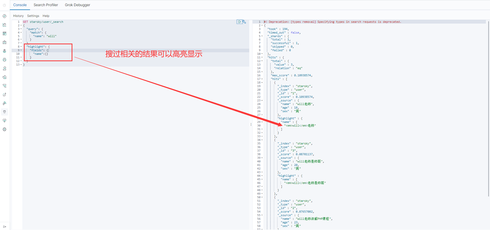

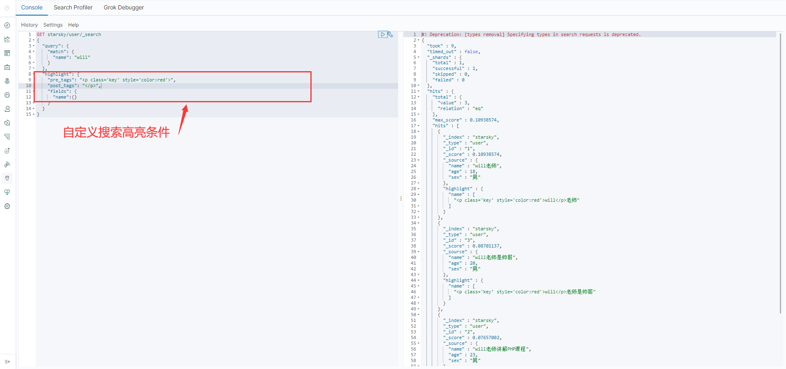

这些其实MySQL 也可以做，只是MySQL 效率比较低！

## 3. 商品列表

### 3.1 分页与排序

首先我们先实现分页与排序功能，先不管搜索以及类目功能：

App/Http/Controllers/ProductController
```php
<?php

namespace App\Http\Controllers;

use Illuminate\Http\Request;
use Illuminate\Pagination\LengthAwarePaginator;
use App\Models\Product;

class ProductController extends Controller
{
    public function index(Request $request)
    {
      $page = $request->input('page',1);
      $perPage = 16;

      //构建查询
      $params = [
        "index" => "products",
        "body" => [
          "from" => ($page - 1) * $perPage,
          "size" => $perPage,
          "query" => [
            "bool" => [
              "filter" => [
                [
                  "term" => [
                  "status" => true
                ],
                "term" => [
                  "audit_status" => 1
                ]
                ],
              ],
            ],
          ],
        ],
      ];
        // 是否有提交 order 参数，如果有就赋值给 $order 变量
      // order 参数用来控制商品的排序规则
      if ($order = $request->input('order', '')) {
          // 是否是以 _asc 或者 _desc 结尾
          if (preg_match('/^(.+)_(asc|desc)$/', $order, $m)) {
              // 如果字符串的开头是这 3 个字符串之一，说明是一个合法的排序值
              if (in_array($m[1], ['price', 'sold_count', 'rating'])) {
                  // 根据传入的排序值来构造排序参数
                  $params['body']['sort'] = [[$m[1] => $m[2]]];
              }
          }
      }

      $result = app('es')->search($params);

      // 通过 collect 函数将返回结果转为集合，并通过集合的 pluck 方法取到返回的商品 ID 数组
      $productIds = collect($result['hits']['hits'])->pluck('_id')->all();
      // 通过 whereIn 方法从数据库中读取商品数据
      $products = Product::query()
          ->whereIn('id', $productIds)
          // orderByRaw 可以让我们用原生的 SQL 来给查询结果排序
          ->orderByRaw(sprintf("FIND_IN_SET(id, '%s')", join(',', $productIds)))
          ->get();
      // 返回一个 LengthAwarePaginator 对象
      $pager = new LengthAwarePaginator($products, $result['hits']['total']['value'], $perPage, $page, [
          'path' => route('products.index', false), // 手动构建分页的 url
      ]);
      return view('products.index', [
          'products' => $pager,
          'filters'  => [
              'search' => '',
              'order'  => $order,
          ]
      ]);
    }

    public function show()
    {
      return "商品详情";
    }
}
?>
```

代码解释：
```
$params = [
  "index" => "products",
  "body" => [
    "from" => ($page - 1) * $perPage,
    "size" => $perPage,
    "query" => [
      "bool" => [
        "filter" => [
          [
            "term" => [
            "status" => true
          ],
          "term" => [
            "audit_status" => 1
          ]
          ],
        ],
      ],
    ],
  ],
];
```

* "index" => "products" ：index表示的是elasticsearch当中的索引，也就是我们在第八节课程中去创建的products
* "body" : 这个表示的我们查询数据的筛选内容，主要是我们的查询条件，以及分页条件。
* "from"：Elasticsearch分页数据从第几行文档开始，"size"：表示的是分页，一页数据数量
* "query"：表示的是查询操作
* "bool":查询类型
* "filter":elasticsearch文档查询结果过滤，里面的term表示的是按照什么字段进行精准查询

>排序
```
// 是否有提交 order 参数，如果有就赋值给 $order 变量
// order 参数用来控制商品的排序规则
if ($order = $request->input('order', '')) {
  // 是否是以 _asc 或者 _desc 结尾
  if (preg_match('/^(.+)_(asc|desc)$/', $order, $m)) {
      // 如果字符串的开头是这 3 个字符串之一，说明是一个合法的排序值
      if (in_array($m[1], ['price', 'sold_count', 'rating'])) {
          // 根据传入的排序值来构造排序参数
          $params['body']['sort'] = [[$m[1] => $m[2]]];
      }
  }
}
```

这里主要是为了做到一个排序作用，比如我们需要按照**商品的销量进行排序**,那么他会传递一个参数叫做order。
order参数的内容就是商品排序的规则，值是相应的排序规则标识。

如果我们存在这这个参数，而传递的排序规则也是我们定义好的，那么我们会在es的查询条件中去增加排序参数。如下：
```
// 根据传入的排序值来构造排序参数
$params['body']['sort'] = [[$m[1] => $m[2]]];
```

>商品数据处理以及排序处理
```
// 通过 collect 函数将返回结果转为集合，并通过集合的 pluck 方法取到返回的商品 ID 数组
$productIds = collect($result['hits']['hits'])->pluck('_id')->all();
// 通过 whereIn 方法从数据库中读取商品数据
$products = Product::query()
    ->whereIn('id', $productIds)
    // orderByRaw 可以让我们用原生的 SQL 来给查询结果排序
    ->orderByRaw(sprintf("FIND_IN_SET(id, '%s')", join(',', $productIds)))
    ->get();
// 返回一个 LengthAwarePaginator 对象
$pager = new LengthAwarePaginator($products, $result['hits']['total']['value'], $perPage, $page, [
    'path' => route('products.index', false), // 手动构建分页的 url
]);
```
返回的到index.php页面如下：


