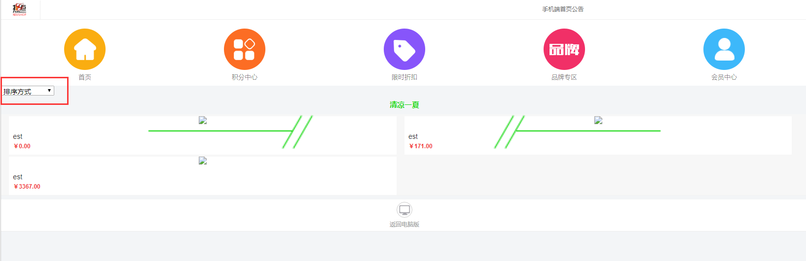
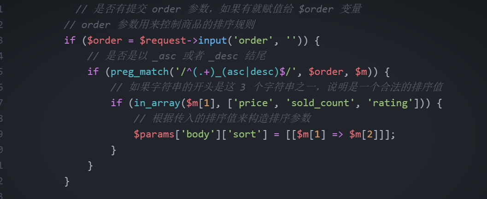
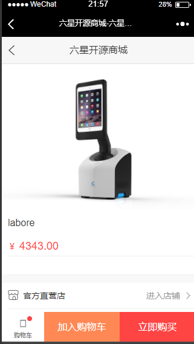

# 商品搜索与商品详情

## 课程内容

1. 商品搜索
2. 商品列表页排序处理
3. 代码封装与优化
4. 商品详情页分析

## 1. 商品搜索

接下来我们要实现关键词搜索功能，需要用到之前学过的多字段匹配查询：

app/Http/Controllers/ProductsController.php
```php
<?php
public function index(Request $request)
{
  .
  .
  .
  //加在es搜索之前即可
  if ($search = $request->input('search', '')) {
      // 将搜索词根据空格拆分成数组，并过滤掉空项
      $keywords = array_filter(explode(' ', $search));

      $params['body']['query']['bool']['must'] = [];
      // 遍历搜索词数组，分别添加到 must 查询中
      foreach ($keywords as $keyword) {
          $params['body']['query']['bool']['must'][] = [
              'multi_match' => [
                  'query'  => $keyword,
                  'fields' => [
                      'title^2',
                      'long_title^2',
                  ],
              ],
          ];
      }
  }
  .
  .
  .
}
?>
```

search 参数传递过来可能会是一个需要按照多个关键词条进行查询的搜索条件，所以我们需要对他进行处理。
```
// 将搜索词根据空格拆分成数组，并过滤掉空项
$keywords = array_filter(explode(' ', $search));
```

尝试在商品页面进行搜索：


## 2. 商品列表页排序处理

先在我们的商品列表页面加入帅选排序的select组件，如下：

```html
<!-- 筛选组件开始 -->
<div class="card">
  <div class="card-body">
<form action="{{ route('products.index') }}" class="search-form">
<div class="form-row">
<input type="hidden" name="search" value="">
<div class="col-md-3">
  <select name="order" class="form-control form-control-sm float-right">
    <option value="">排序方式</option>
    <option value="price_asc">价格从低到高</option>
    <option value="price_desc">价格从高到低</option>
    <option value="sold_count_desc">销量从高到低</option>
    <option value="sold_count_asc">销量从低到高</option>
    <option value="rating_desc">评价从高到低</option>
    <option value="rating_asc">评价从低到高</option>
  </select>
</div>
</div>
</form>
</div>
</div>
<script>
var filters = {!! json_encode($filters) !!};
$(document).ready(function () {
	$('.custom-search input[name=search]').val(filters.search);
	$('.search-form select[name=order]').val(filters.order);
	$('.search-form input[name=search]').val(filters.search);
	$('.search-form select[name=order]').on('change',function () {
		$('.search-form').submit();
	})
})
</script>
<!-- 筛选组件结束 -->
```

页面样式展示如下：



select组件的选项值分别会有_asc或者是_desc后缀结尾，这个是我们用于判断他是正向排序与逆向排序的依据。
这个是在查询前进行的处理：



## 3. 代码封装与优化

我们完成了商品列表的各项搜索功能，但是商品列表控制器十分臃肿，里面有大量的代码用于构建 Elasticsearch 的查询，为了让代码布局更合理，同时提高复用性，接下来我们要对 Elasticsearch 的查询做一个简单的封装。

>1. 创建查询构造器

我们目前的查询还比较单一，没有必要写一个像 Laravel Query Builder 那种十分灵活的查询构造器，因此只需要做一些简单的封装即可
首先我们创建一个 ProductSearchBuilder 类：
```
mkdir -p app/SearchBuilders
touch app/SearchBuilders/ProductSearchBuilder.php
```

app/SearchBuilders/ProductSearchBuilder.php
```php
<?php
namespace App\SearchBuilders;

use App\Models\Category;

class ProductSearchBuilder
{
   // 初始化查询
   protected $params = [
       'index' => 'products',
       'type'  => '_doc',
       'body'  => [
           'query' => [
               'bool' => [
                   'filter' => [],
                   'must'   => [],
               ],
           ],
       ],
   ];

   // 添加分页查询
   public function paginate($size, $page)
   {
       $this->params['body']['from'] = ($page - 1) * $size;
       $this->params['body']['size'] = $size;

       return $this;
   }

   // 筛选上架状态的商品
   public function onSale()
   {
       $this->params['body']['query']['bool']['filter'][] = [
         'term' => ['status' => true],
         'term' => ['audit_status' => 1]
       ];

       return $this;
   }

   // 添加搜索词
   public function keywords($keywords)
   {
       // 如果参数不是数组则转为数组
       $keywords = is_array($keywords) ? $keywords : [$keywords];
       foreach ($keywords as $keyword) {
           $this->params['body']['query']['bool']['must'][] = [
               'multi_match' => [
                   'query'  => $keyword,
                   'fields' => [
                       'title^3',
                       'long_title^2',
                   ],
               ],
           ];
       }

       return $this;
   }

   // 添加排序
   public function orderBy($field, $direction)
   {
       if (!isset($this->params['body']['sort'])) {
           $this->params['body']['sort'] = [];
       }
       $this->params['body']['sort'][] = [$field => $direction];

       return $this;
   }

   // 返回构造好的查询参数
   public function getParams()
   {
       return $this->params;
   }
}
?>
```

整理ProductController的index方法，如下：
```php
<?php
public function index(Request $request)
{
  $page = $request->input('page',1);
  $perPage = 16;
  //构建查询
  $builder = (new ProductSearchBuilder)->onSale()->paginate($page,$perPage);

  if ($search = $request->input('search', '')) {
    $keywords = array_filter(explode(' ',$search));
    $builder->keywords($search);
  }

  // 是否有提交 order 参数，如果有就赋值给 $order 变量
  // order 参数用来控制商品的排序规则
  if ($order = $request->input('order', '')) {
      // 是否是以 _asc 或者 _desc 结尾
      if (preg_match('/^(.+)_(asc|desc)$/', $order, $m)) {
          // 如果字符串的开头是这 3 个字符串之一，说明是一个合法的排序值
          if (in_array($m[1], ['price', 'sold_count', 'rating'])) {
              // 根据传入的排序值来构造排序参数
              $builder->orderBy($search);
          }
      }
  }

  $result = app('es')->search($builder->getParams());

  .
  .
  .
}
?>
```

测试方向：
```
1. 访问商品列表，能够展示商品列表，有分页
2. 点击分页相关，能够正常返回分页数据
3. 通过选择排序方式，能够按照选择的方式正常排序
4. 能够多个关键字段进行搜索
5. 搜索与排序方式可以同时筛选商品
```

## 4. 商品详情页分析

html页面：resources/views/products/goodsdetail.blade.php

页面展示：



在ProductController中定义show方法，调整代码如下：

```php
<?php
public function show(Product $product,Request $request)
{
  //判断查询的商品是否上架以及是否通过超级管理员审核
  if (!$product->status) {
    throw new \Exception("商品未上架", 1);
  }

  if (!$product->audit_status) {
    throw new \Exception("请等待商品审核", 1);
  }

  //通过with预加载查询商品相关数据
  $product = $product->where('id',$product->id)->with([
    'skus',
    'properties',
    'images',
    'productdescriptions'
  ])->first();
  return view('products.goodsdetail',[
    'product' => $product,
    'skus' => $product->skus,
    'properties' => $product->properties,
    'images' => $product->images,
    'productdescriptions' => $product->productdescriptions
  ]);
}
?>
```
