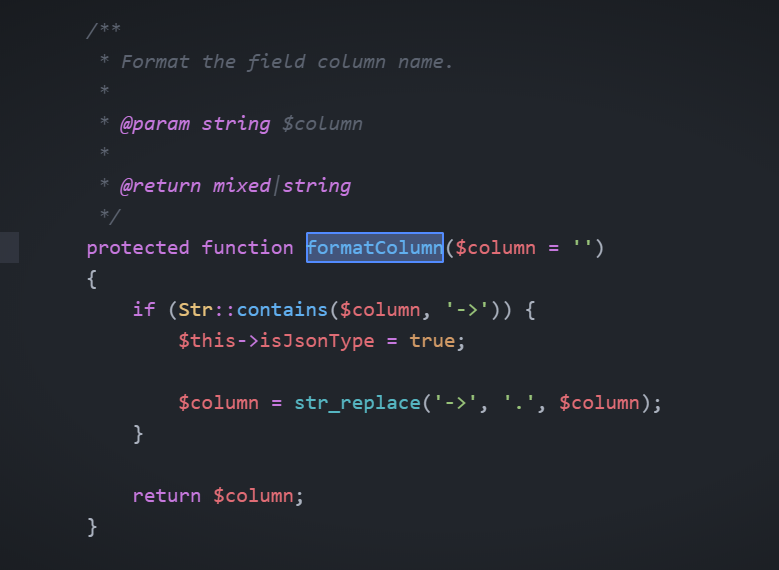
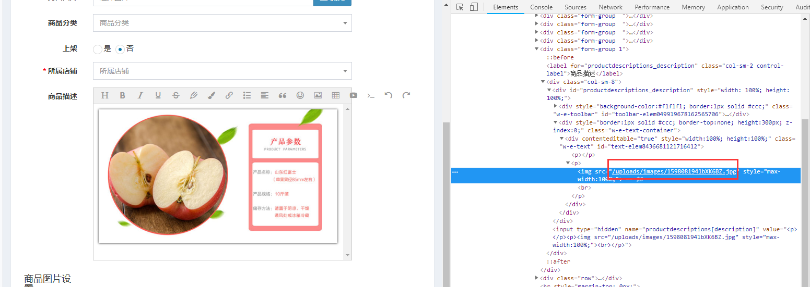
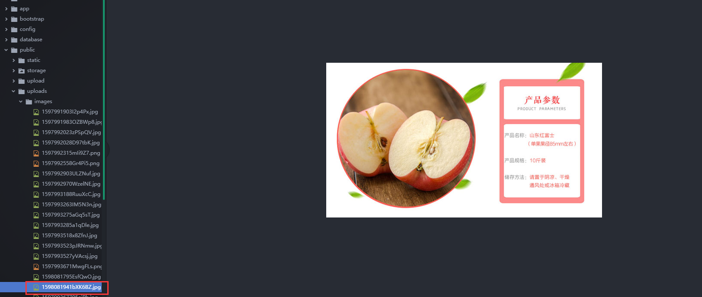
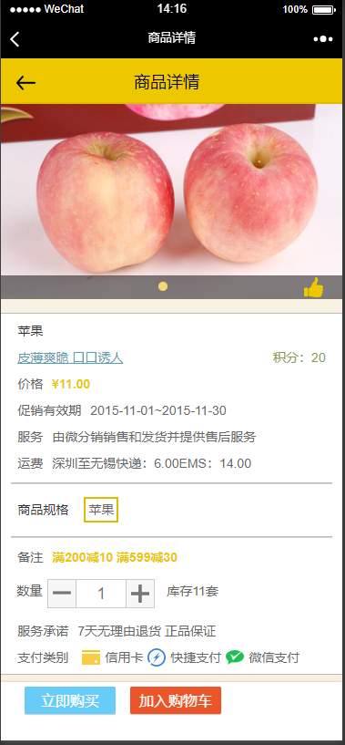
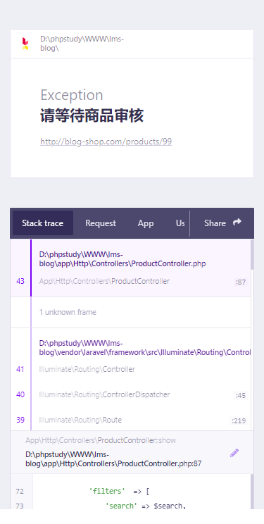
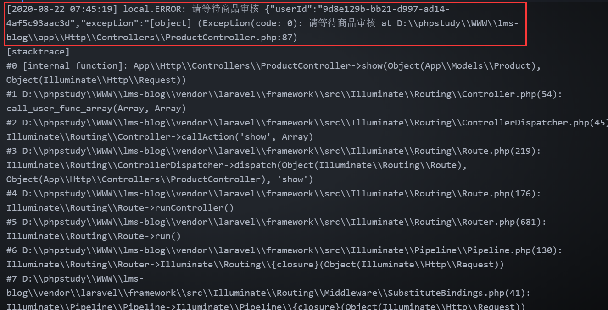
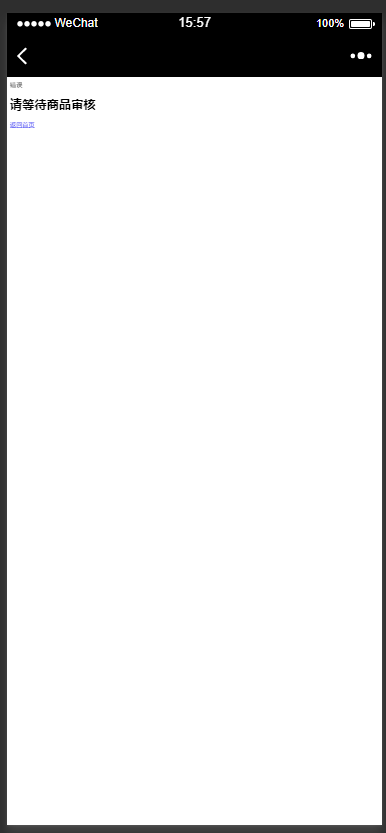
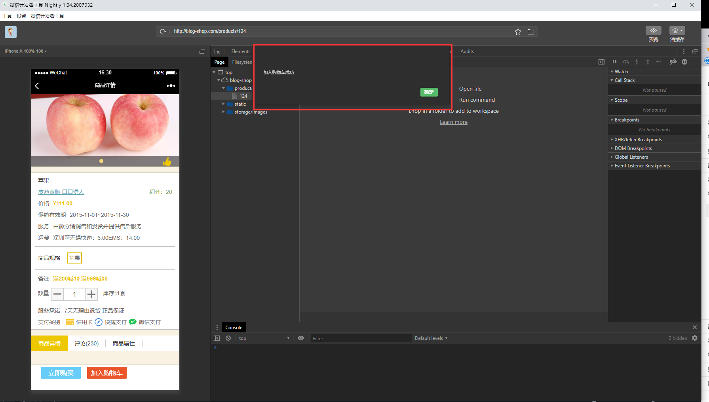

# 商品详情与购物车

## 课程内容

1. 商品新增-富文本上传图片
2. 商品详情页数据查询
3. 对于商品异常处理
4. 加入购物车
5. 购物车列表

>素材说明：

```
商品详情界面：resources\views\products\productdetail.blade.php（之前的商品详情界面并不能满足我们的需求，这个是重构之后的界面，可以在views里面去获取）
购物车界面：resources\views\products\cart.blade.php
购物车js文件: public\static\js\cart.js
```
## 1. 商品新增-富文本上传图片

在商品新增页面中我们给laravel-admin新增了富文本wang-editor，但是我们所做的商品详情也只是普通文字的添加，并没有什么特色。

>第一步：在控制器中定义富文本图片上传

```php
<?php
namespace App\Http\Controllers;

use Illuminate\Http\Request;
use Illuminate\Support\Str;

class UploadsController extends Controller
{
    public function uploadImg(Request $request)
    {
        //请求来自富文本传递的图片信息
        $file = $request->file("mypic");
        if (!empty($file)) {
            foreach ($file as $key => $value) {
                $len = $key;
            }
            if ($len > 25) {
                return response()->json(['ResultData' => 6, 'info' => '最多可以上传25张图片']);
            }
            $m = 0;
            $k = 0;
            for ($i = 0; $i <= $len; $i++) {
                // $n 表示第几张图片
                $n = $i + 1;
                if ($file[$i]->isValid()) {
                  //限制图片上传类型
                    if (in_array(strtolower($file[$i]->extension()), ['jpeg', 'jpg', 'gif', 'gpeg', 'png'])) {
                        $picname = $file[$i]->getClientOriginalName();//获取上传原文件名
                        $ext = $file[$i]->getClientOriginalExtension();//获取上传文件的后缀名
                        // 重命名
                        $filename = time() . Str::random(6) . "." . $ext;
                        if ($file[$i]->move("uploads/images", $filename)) {
                            $newFileName = '/' . "uploads/images" . '/' . $filename;//图片上传的路径设置
                            $m = $m + 1;
                            // return response()->json(['ResultData' => 0, 'info' => '上传成功', 'newFileName' => $newFileName ]);
                        } else {
                            $k = $k + 1;
                            // return response()->json(['ResultData' => 4, 'info' => '上传失败']);
                        }
                        $msg = $m . "张图片上传成功 " . $k . "张图片上传失败<br>";
                        $return[] = ['ResultData' => 0, 'info' => $msg, 'newFileName' => $newFileName];
                    } else {
                        return response()->json(['ResultData' => 3, 'info' => '第' . $n . '张图片后缀名不合法!<br/>' . '只支持jpeg/jpg/png/gif格式']);
                    }
                } else {
                    return response()->json(['ResultData' => 1, 'info' => '第' . $n . '张图片超过最大限制!<br/>' . '图片最大支持2M']);
                }
            }
        } else {
            return response()->json(['ResultData' => 5, 'info' => '请选择文件']);
        }
        return $return;
    }
}
?>
```

代码解释：

```
上面代码主要是限制图片的上传数量，上传的类型以及对于图片进行上传路径，名称进行重构。通过response()->json()方式返回相关错误信息同时也终止图片上传程序。
```

>第二步: 重构admin富文本前端资源以及新增图片上传js及相关信息

```php
<?php

namespace App\Admin\Extensions;

use Encore\Admin\Form\Field;

class WangEditor extends Field
{
    //视图属性
    protected $view = 'admin.wang-editor';

    //wang-editor富文本css资源路径
    protected static $css = [
        '/vendor/laravel-admin-ext/wang-editor/wangEditor-3.0.10/release/wangEditor.min.css',
    ];

    //wang-editor富文本js资源路径
    protected static $js = [
        '/vendor/laravel-admin-ext/wang-editor/wangEditor-3.0.10/release/wangEditor.min.js',
    ];

    public function render()
    {
        $name = $this->formatName($this->column);//获取form表单相关字段

        //定义js获取图片信息，传递到后台控制器
        $this->script = <<<EOT

var E = window.wangEditor
var editor = new E('#{$this->id}');
editor.customConfig.uploadFileName = 'mypic[]';
editor.customConfig.uploadImgHeaders = {
    'X-CSRF-TOKEN': $('input[name="_token"]').val()
}
editor.customConfig.zIndex = 0;
// 上传路径
editor.customConfig.uploadImgServer = '/uploadFile';
editor.customConfig.onchange = function (html) {
    $("input[name='$name']").val(html);
}
editor.customConfig.uploadImgHooks = {
    customInsert: function (insertImg, result, editor) {
        if (typeof(result.length) != "undefined") {
            for (var i = 0; i <= result.length - 1; i++) {
                var j = i;
                var url = result[i].newFileName;
                insertImg(url);
            }
            toastr.success(result[j]['info']);
        }

        switch (result['ResultData']) {
            case 6:
                toastr.error("最多可以上传4张图片");
                break;
            case 5:
                toastr.error("请选择一个文件");
                break;
            case 4:
                toastr.error("上传失败");
                break;
            case 3:
                toastr.error(result['info']);
                break;
            case 2:
                toastr.error("文件类型不合法");
                break;
            case 1:
                toastr.error(result['info']);
                break;
        }
    }
}
editor.create();

// var editor = new wangEditor('{$this->id}');
//     editor.create();

EOT;
        return parent::render();

    }
}
?>
```

>第三步：新建富文本视图

新建视图:

```
mkdir resources/views/admin
touch resources/views/admin/wang-editor.blade.php
```

填充html代码：
```html
<div class="form-group {!! !$errors->has($label) ?: 'has-error' !!}">
    <label for="{{$id}}" class="col-sm-2 control-label">{{$label}}</label>
    <div class="{{$viewClass['field']}}">
        @include('admin::form.error')
        <div id="{{$id}}" style="width: 100%; height: 100%;">
            <p>{!! old($column, $value) !!}</p>
        </div>
        <input type="hidden" name="{{$name}}" value="{{ old($column, $value) }}" />
    </div>
</div>
```

代码解释：
```
$this->formatName()该属性来自于wang-editor类继承的field类中的formatName()。$this->column也是同理，通过field可以获取到商品详情字段信息，随后上传的图片也会新增到该数据中。
```

继承的方法如下：



>第四步:在admin/bootstrap.php中引入我们前面建立的资源并添加图片上传路由

app\Admin\bootstrap.php
```php
<?php
use App\Admin\Extensions\WangEditor;
use Encore\Admin\Form;
Encore\Admin\Form::forget(['map']);
Form::extend('editor',WangEditor::class);
?>
```

添加路由：

routes/web.php
```php
<?php
Route::post('uploadFile','UploadsController@uploadImg')->name('admin.uploadImg');
?>
```

在商品新增页进行测试：



上传的商品图片：



## 2. 商品详情页数据查询

我们在讲解商品列表页时已经在ProductController中新建了show()方法，下我们只需要对他进行调整就可以了。

app/Http/Controllers/ProductController
```php
<?php
public function show(Product $product,Request $request)
{
  if (!$product->status) {
    throw new \Exception("商品未上架",1);
  }

  if (!$product->audit_status) {
    throw new \Exception("请等待商品审核",1);
  }

  $product = $product->where('id',$product->id)->with([
    'skus',
    'properties',
    'images',
    'productdescriptions'
  ])->first();

  foreach ($product->images as $key) {
    foreach ($key->image_url as $value) {
      $images[] = $value;
    }
  }

  return view('products.productdetail',[
    'product' => $product, //商品
    'skus' => $product->skus, //商品sku
    'properties' => $product->properties,//商品属性
    'images' => $images,//商品详情页图片
    'productdescriptions' => $product->productdescriptions,//商品详情
  ]);
}
?>
```

代码解释:

```
throw new \Exception("商品未上架",1)：throw new \Exception主要是在程序处于非常流程时抛出异常来终止程序运行。

用户从商品列表或者是其他页面跳转到详情页会传递商品id参数，而在show()方法中主要是两个参数一个是商品模型，一个是请求管理类，模型会通过我们传递的id确定数据，所以我们可以通过这个商品对象进行数据的查询。

对于数据的查询这边是使用的with方法，通过模型当中定义的关联方法查询数据
```

>添加路由

routes/web.php
```php
<?php
//auth是中间件是用于在用户访问其中的路由时检测是否登录
Route::group(['middleware' => ['auth']],function (){
  Route::get('products/{product}', 'ProductController@show')->name('products.show');
});
?>
```

访问这个路由，查看页面：



主要测试方向：

1. 选择sku，库存与价格可以随着sku的变化而变化
2. 商品详情需要正常输出html标签
3. 商品详情能够正常显示富文本上传图片

## 3. 对于商品异常处理

在商品详情页我们使用了throw new Exception来处理异常与程序异常终止。

```
if (!$product->status) {
  throw new \Exception("商品未上架",1);
}

if (!$product->audit_status) {
  throw new \Exception("请等待商品审核",1);
}
```

可以尝试触发这个异常，会看到类似下面的界面：



这样的提示是非常不友好的，我们需要对异常做下处理.

### 3.1 异常

异常指的是在程序运行过程中发生的异常事件，通常是由外部问题所导致的。异常处理是程序开发中经常遇到的任务，如何优雅地处理异常，从一定程度上反映了你的程序是否足够严谨。我们将异常大致分为 用户异常 和 系统异常，接下来我们将分别对其讲解和代码实现。

>1. 用户错误行为触发的异常

比如访问一个被下架的商品时触发的异常，对于此类异常我们需要把触发异常的原因告知用户。我们把这类异常命名为 InvalidRequestException，可以通过 make:exception 命令来创建：

```
php artisan make:exception InvalidRequestException
```

新创建的异常文件保存在 app/Exceptions/ 目录下：

app/Exceptions/InvalidRequestException.php
```php
<?php
namespace App\Exceptions;

use Exception;
use Illuminate\Http\Request;

class InvalidRequestException extends Exception
{
    public function __construct(string $message = "", int $code = 400)
    {
        parent::__construct($message, $code);
    }

    public function render(Request $request)
    {
        if ($request->expectsJson()) {
            // json() 方法第二个参数就是 Http 返回码
            return response()->json(['msg' => $this->message], $this->code);
        }

        return view('pages.error', ['msg' => $this->message]);
    }
}
?>
```

Laravel 5.5 之后支持在异常类中定义 render() 方法，该异常被触发时系统会调用 render() 方法来输出，我们在 render() 里判断如果是 AJAX 请求则返回 JSON 格式的数据，否则就返回一个错误页面。

创建错误页面：

```
touch resources/views/pages/error.blade.php
```
```html
<div class="card">
    <div class="card-header">错误</div>
    <div class="card-body text-center">
        <h1>{{ $msg }}</h1>
        <a class="btn btn-primary" href="{{ route('root') }}">返回首页</a>
    </div>
</div>
```
当异常触发时 Laravel 默认会把异常的信息和调用栈打印到日志里，比如：



而此类异常并不是因为我们系统本身的问题导致的，不会影响我们系统的运行，如果大量此类日志打印到日志文件里反而会影响我们去分析真正有问题的异常，因此需要屏蔽这个行为。

Laravel 内置了屏蔽指定异常写日志的解决方案：

app/Exceptions/Handler.php
```php
<?php
protected $dontReport = [
    InvalidRequestException::class,
];
?>
```

当一个异常被触发时，Laravel 会去检查这个异常的类型是否在 $dontReport 属性中定义了，如果有则不会打印到日志文件中。

>2, 系统内部异常

比如连接数据库失败，对于此类异常我们需要有限度地告知用户发生了什么，但又不能把所有信息都暴露给用户（比如连接数据库失败的信息里会包含数据库地址和账号密码），因此我们需要传入两条信息，一条是给用户看的，另一条是打印到日志中给开发人员看的。

新建一个 InternalException 类：
```
php artisan make:exception InternalException
```

app/Exceptions/InternalException.php
```php
<?php
namespace App\Exceptions;

use Exception;
use Illuminate\Http\Request;

class InternalException extends Exception
{
    protected $msgForUser;

    public function __construct(string $message, string $msgForUser = '系统内部错误', int $code = 500)
    {
        parent::__construct($message, $code);
        $this->msgForUser = $msgForUser;
    }

    public function render(Request $request)
    {
        if ($request->expectsJson()) {
            return response()->json(['msg' => $this->msgForUser], $this->code);
        }

        return view('pages.error', ['msg' => $this->msgForUser]);
    }
}
?>
```

这个异常的构造函数第一个参数就是原本应该有的异常信息比如连接数据库失败，第二个参数是展示给用户的信息，通常来说只需要告诉用户 系统内部错误 即可，因为不管是连接 Mysql 失败还是连接 Redis 失败对用户来说都是一样的，就是系统不可用，用户也不可能根据这个信息来解决什么问题。

>在代码中去使用

```php
<?php
use App\Exceptions\InvalidRequestException;
.
.
.
    public function show(Product $product, Request $request)
    {
        if (!$product->status) {
            throw new InvalidRequestException('商品未上架');
        }

        if (!$product->audit_status) {
            throw new InvalidRequestException('请等待商品审核');
        }
        .
        .
        .
    }
?>
```



## 4. 加入购物车

购物车表字段介绍:

lms_cart_items:

| 字段名称       | 描述       | 类型   |
| -------------- | ---------- | ------ |
| id             | 自增id     | bigint |
| user_id        | 所属用户id | bigint |
| product_sku_id | 商品sku_id | bigint |
| amount         | 商品数量   | int    |

**模型创建跳过**

购物车模型代码

app/Models/CartItem.php
```php
<?php
namespace App\Models;

use Illuminate\Database\Eloquent\Model;

class CartItem extends Model
{
  protected $connection = 'mysql_products';
  protected $fillable = ['amount'];
  public $timestamps = false;

  public function user()
  {
    return $this->belongsTo(User::class);
  }

  public function productSku()
  {
    return $this->belongsTo(ProductSku::class);
  }
}
?>
```

然后在 User 模型中加上关联关系：

```php
<?php
public function cartItems()
{
    return $this->hasMany(CartItem::class);
}
?>
```

我们将商品添加到购物车的时候会提交两个参数：

1. 商品sku_id
2. 数量

对于商品与数量我们需要做一些校验，比如：商品是否存在，库存是否满足等，那么就需要针对以上参数做出不同的规则来进行校验。可以新建AddCartRequest，一个关于购物车商品新增校验的类。

```php
<?php
namespace App\Http\Requests;

use App\Models\ProductSku;
use Illuminate\Foundation\Http\FormRequest;

class AddCartRequest extends FormRequest
{
    public function rules()
    {
        return [
            'sku_id' => [
                'required',
                function ($attribute, $value, $fail) {
                    if (!$sku = ProductSku::find($value)) {
                        return $fail('该商品不存在');
                    }
                    if (!$sku->product->status) {
                        return $fail('该商品未上架');
                    }
                    if ($sku->stock === 0) {
                        return $fail('该商品已售完');
                    }
                    if ($this->input('num') > 0 && $sku->stock < $this->input('num')) {
                        return $fail('该商品库存不足');
                    }
                    if (!$sku->product->audit_status) {
                      return $fail('该商品未通过审核');
                    }
                },
            ],
            'num' => ['required', 'integer', 'min:1'],
        ];
    }

    public function attributes()
    {
        return [
            'num' => '商品数量'
        ];
    }

    public function messages()
    {
        return [
            'sku_id.required' => '请选择商品'
        ];
    }
}
?>
```

校验 sku_id 的第二个规则是一个闭包校验规则，这个闭包接受 3 个参数，分别是参数名、参数值和错误回调。在这个闭包里我们依次判断了用户提交的 SKU ID 是否存在、商品是否上架以及库存是否充足。

闭包校验规则允许我们直接通过匿名函数的方式来校验用户输入，比较适合在项目中只使用一次的情况。闭包校验规则可以看这里：https://learnku.com/docs/laravel/5.6/validation/1372#using-rule-objects

接下来我们在 CartController 添加一个 add() 方法，参数就是我们刚刚创建的 AddCartRequest(**这里老师已经偷偷建立了控制器了哦**)

app/Http/Controllers/CartController.php
```php
<?php
namespace App\Http\Controllers;

use Illuminate\Http\Request;
use App\Http\Requests\AddCartRequest;
use App\Models\CartItem;

class CartController extends Controller
{
  public function add(AddCartRequest $request)
  {
    $user   = $request->user();
    $skuId  = $request->input('sku_id');
    $amount = $request->input('num');

    // 从数据库中查询该商品是否已经在购物车中
    if ($cart = $user->cartItems()->where('product_sku_id', $skuId)->first()) {
        // 如果存在则直接叠加商品数量
        $cart->update([
            'amount' => $cart->amount + $amount,
        ]);
    } else {
        // 否则创建一个新的购物车记录
        $cart = new CartItem(['amount' => $amount]);
        $cart->user()->associate($user);
        $cart->productSku()->associate($skuId);
        $cart->save();
    }

    return [];
  }
}
?>
```

>添加路由

routes/web.php
```php
<?php
//auth是中间件是用于在用户访问其中的路由时检测是否登录
Route::group(['middleware' => ['auth']],function (){
  .
  .
  .
  Route::post('cart', 'CartController@add')->name('cart.add');
});
?>
```
测试：



测试注意点：

1. 商品已经存在数据库，不新增数据，数量+1
2. 购物车新增商品

## 5. 购物车列表

```php
<?php
.
.
.
public function index(Request $request)
{
  $cartItems = $request->user()->cartItems()->with(['productSku.product','productSku.product.shop'])->get();
  // dd($cartItems);
  return view('products.cart',['cartItems' => $cartItems]);
}
.
.
.
?>
```

代码解释：
```
with(['productSku.product']) 方法用来预加载购物车里的商品和 SKU 信息。如果这里没有进行预加载而是在渲染模板时通过 $item->productSku->product 这种懒加载的方式，就会出现购物车中的每一项都要执行多次商品信息的 SQL 查询，导致单个页面执行的 SQL 数量过多，加载性能差的问题，也就是经典的 N + 1 查询问题。使用了预加载之后，Laravel 会通过类似 select * from product_skus where id in (xxxx) 的方式把原本需要多条 SQL 查询的数据用一条 SQL 就查到了，大大提升了执行效率。同时 Laravel 还支持通过 . 的方式加载多层级的关联关系，这里我们就通过 . 提前加载了与商品 SKU 关联的商品。
```

>添加路由

```php
<?php
Route::group(['middleware' => ['auth']], function() {
    .
    .
    .
    Route::get('cart', 'CartController@index')->name('cart.index');
});
?>
```
