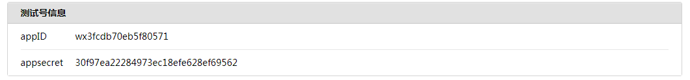
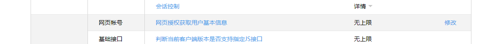
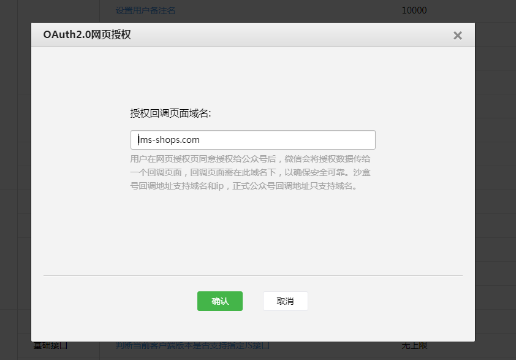

@[TOC](项目构建)
#  1.项目构建
##  1.1.环境准备
###  1.1.1.运行环境
	系统：Centos=>7.2
	PHP=> 7.3
	swoole=>4.15
	mysql=>8.0
	lavaral=>6.18
	composer(版本没要求)
	node.js(版本没要求)
###  1.1.2.运行环境搭建
####  1.1.2.1.php+swoole+mysql
	推荐使用宝塔(略)
	yum install -y wget && wget -O install.sh http://download.bt.cn/install/install_6.0.sh && sh install.sh
####  1.1.2.1.laravel安装
	composer create-project --prefer-dist laravel/laravel blog "6.*"
		
#  2.微信授权登录
##  2.1.微信测试号申请
###  2.1.1.账号申请
	微信公众号测试号获取地址：https://mp.weixin.qq.com/debug/cgi-bin/sandbox?t=sandbox/login

###  2.1.2.账号设置




##  2.2.laravel微信授权登录
	网页授权流程分为四步：
	1、引导用户进入授权页面同意授权，获取code
```
/www/wwwroot/lms/blog/app/Http/Controller/WeChateController.php
<?php
public function wxcode()
{
  //微信授权登录相关信息
  $params = http_build_query([
  'appid' => 'wx3fcdb70eb5f80571', //微信公众平台提供的appid
  'redirect_uri' => 'http://blog-shop.com/wxtoken', //你想要回调的地址
  'response_type' => 'code',
  'scope' => 'snsapi_userinfo',
]);
  //第一步：用户同意授权，获取code
  $url = $url = 'https://open.weixin.qq.com/connect/oauth2/authorize?' . $params . '#wechat_redirect';//获取用户code接口
  return redirect($url);
}
?>
```
	2、通过code换取网页授权access_token（与基础支持中的access_token不同）
```
/www/wwwroot/lms/blog/app/Http/Controller/WeChateController.php
<?php
public function wxtoken(Request $resquest)
{
  #根据拿到的code值去访问用户的access_token令牌
  $params = http_build_query([
          'appid' => 'wx3fcdb70eb5f80571',
          'secret' => '0864a3720d5972c8bbb49e029cbd033f',
          'code' => $resquest->input('code'),
          'grant_type' => 'authorization_code'
  ]);
  $url = 'https://api.weixin.qq.com/sns/oauth2/access_token?' . $params;
  $result = file_get_contents($url);
  $access_token = json_decode($result);
  dd($access_token);
}
 ?>
```
	3、如果需要，开发者可以刷新网页授权access_token，避免过期（这里只需要根据上面的接口一样进行数据获取即可） 
	4、通过网页授权access_token和openid获取用户基本信息（支持UnionID机制）
```
/www/wwwroot/lms/blog/app/Http/Controller/WeChateController.php
<?php
public function wxtoken(Request $resquest)
{
  #根据拿到的code值去访问用户的access_token令牌
  $params = http_build_query([
          'appid' => 'wx3fcdb70eb5f80571',
          'secret' => '0864a3720d5972c8bbb49e029cbd033f',
          'code' => $resquest->input('code'),
          'grant_type' => 'authorization_code'
  ]);
  $url = 'https://api.weixin.qq.com/sns/oauth2/access_token?' . $params;
  $result = file_get_contents($url);
  $access_token = json_decode($result);

  $params = http_build_query([
    'access_token' => $access_token->access_token,
    'openid' => $access_token->openid,
    'lang' => 'zh_CN'
  ]);

  $url = "https://api.weixin.qq.com/sns/userinfo?".$params;
  $UserInfo = json_decode(file_get_contents($url));
  dd($UserInfo);
}
?>
```
	配置路由
```
/www/wwwroot/lms/blog/routes/web.php
<?php
Route::get('/', function () {
    return view('welcome');
});
Route::get('wxcode','WeChateController@wxcode');
Route::get('wxtoken','WeChateController@wxtoken');
?>
```
	运行结果


##  2.3.esaywechat微信授权登录
###  2.3.1 安装
	composer require "overtrue/laravel-wechat:~5.0"
###  2.3.2 laravel整合
	创建配置文件
	php artisan vendor:publish --provider="Overtrue\LaravelWeChat\ServiceProvider"
	修改配置文件
```
/www/wwwroot/lms/blog/config/wechat.php
  /*
     * 公众号
     */
    'official_account' => [
        'default' => [
            'app_id' => env('WECHAT_OFFICIAL_ACCOUNT_APPID', 'wx3fcdb70eb5f80571'),         // AppID
            'secret' => env('WECHAT_OFFICIAL_ACCOUNT_SECRET', '30f97ea22284973ec18efe628ef69562'),    // AppSecret
            'token' => env('WECHAT_OFFICIAL_ACCOUNT_TOKEN', ''),           // Token
            'aes_key' => env('WECHAT_OFFICIAL_ACCOUNT_AES_KEY', ''),                 // EncodingAESKey

            /*
             * OAuth 配置
             *
             * scopes：公众平台（snsapi_userinfo / snsapi_base），开放平台：snsapi_login
             * callback：OAuth授权完成后的回调页地址(如果使用中间件，则随便填写。。。)
             */
            'oauth' => [
                'scopes'   => array_map('trim', explode(',', env('WECHAT_OFFICIAL_ACCOUNT_OAUTH_SCOPES', 'snsapi_userinfo'))),
                'callback' => env('WECHAT_OFFICIAL_ACCOUNT_OAUTH_CALLBACK', '/examples/oauth_callback.php'),
            ],
        ],
    ],

/www/wwwroot/lms/blog/.evn

WECHAT_OFFICIAL_ACCOUNT_APPID = wx3fcdb70eb5f80571
WECHAT_OFFICIAL_ACCOUNT_SECRET = 30f97ea22284973ec18efe628ef69562
```
	注册中间件
	/www/wwwroot/lms/blog/app/Http/Kernel.php 中的 protected $routeMiddleware 节点添加
	'Auth.WeChat' => \Overtrue\LaravelWeChat\Middleware\OAuthAuthenticate::class,
```
/www/wwwroot/lms/blog/config/app.php 中的 providers与 节点中添加

'providers' => [
  ...
  \Overtrue\LaravelWeChat\ServiceProvider::class,
]

'aliases' => [
  ...
  'EasyWeChat' => \Overtrue\LaravelWeChat\Facade::class,
]
```
	创建测试路由，添加中间件
	
	Route::get('wechat/auth', function(){
    $wechat = session('wechat.oauth_user.default'); //拿到授权用户资料
    dd($wechat); //打印出授权用户资料})->middleware('Auth.WeChat');

###  2.3.3 常见问题

		
	这个错误是因为我们并没授权登录，在esaywechat拉取授权登录信息的时候重定向头信息验证出现异常。
	解决：可以通过修改中间件代码去解决问题
	修改 \Overtrue\LaravelWeChat\Middleware\OAuthAuthenticate 中的handle方法代码，如下：
	<?php
	session([$sessionKey => $officialAccount->oauth->userFromCode($request->get('code')) ?? []]);
	修改为:
	session([$sessionKey => $officialAccount->oauth->user() ?? []]);
	
	return redirect()->to($officialAccount->oauth->scopes($scope)->redirect($request->fullUrl()));
	修改为：
	return r$officialAccount->oauth->scopes($scope)->redirect($request->fullUrl())；
	?>


	这个错误是因为id为int导致的remember_token不通过auth。
	解决：可以通过修改中间件代码去解决问题
	在/www/wwwroot/lms/blog/app/user.php 加上代码，如下：
	public $incrementing = false;//设置主键非自增
