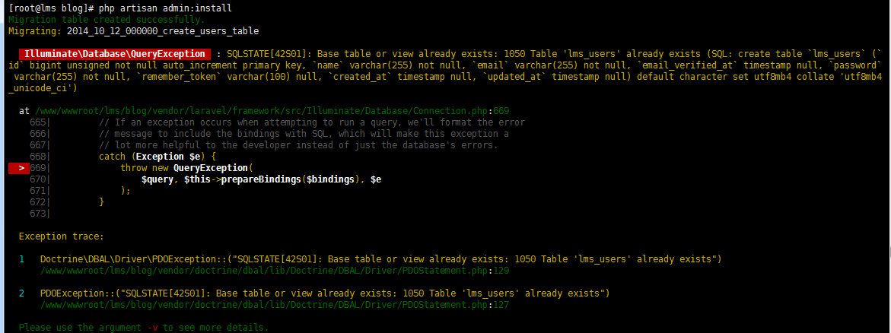
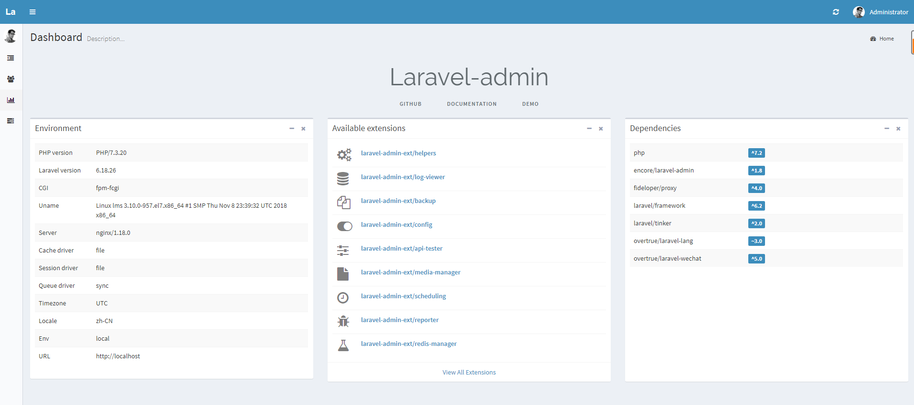

@[TOC](laravel-admin商品分类管理)
# 1.laravel-admin安装
## 1.1.环境准备
	创建数据库
	users-------->略
	products-------->略
## 1.2.安装
	cd /www/wwwroot/lms/blog/
	安装
	composer require encore/laravel-admin
	发布资源
	php artisan vendor:publish --provider="Encore\Admin\AdminServiceProvider"
	完成安装
	php artisan admin:install
	会出现如下错误

	解决方法
	删除  /www/wwwroot/lms/blog/database/migrations/2014_10_12_000000_create_users_table
	然后再执行
	php artisan admin:install
	[root@lms blog]# php artisan admin:install
	Migrating: 2014_10_12_100000_create_password_resets_table
	Migrated:  2014_10_12_100000_create_password_resets_table (0.06 seconds)
	Migrating: 2016_01_04_173148_create_admin_tables
	Migrated:  2016_01_04_173148_create_admin_tables (0.43 seconds)
	Migrating: 2019_08_19_000000_create_failed_jobs_table
	Migrated:  2019_08_19_000000_create_failed_jobs_table (0.02 seconds)
	Database seeding completed successfully.
	Admin directory was created: /app/Admin
	HomeController file was created: /app/Admin/Controllers/HomeController.php
	AuthController file was created: /app/Admin/Controllers/AuthController.php
	ExampleController file was created: /app/Admin/Controllers/ExampleController.php
	Bootstrap file was created: /app/Admin/bootstrap.php
	Routes file was created: /app/Admin/routes.php
	[root@lms blog]# php artisan admin:make UserController --model=App\\User
	App\Admin\Controllers\UserController created successfully.
	说明已经执行成功
	在浏览器中输入:http://lms-shops.com/admin/

	
	用户名：admin 密码：admin

	
	同时会生成如下文件
	app/Admin
	├── Controllers
	│   ├── ExampleController.php
	│   └── HomeController.php
	├── bootstrap.php
	└── routes.php
	
	app/Admin/routes.php文件用来配置后台路由。
	app/Admin/bootstrap.php 是laravel-admin的启动文件, 使用方法请参考文件里面的注释.
	app/Admin/Controllers目录用来存放后台控制器文件，该目录下的HomeController.php
	文件是后台首页的显示控制器，		ExampleController.php为实例文件
	静态文件：后台所需的前端静态文件在/public/vendor/laravel-admin目录下.
## 1.2.汉化
	1. 通过composer安装语言包：
	composer require "overtrue/laravel-lang:~3.0"
	2. 将项目文件 config/app.php中的
	Illuminate\Translation\TranslationServiceProvider::class 替换为
	Overtrue\LaravelLang\TranslationServiceProvider::class 	
	3. 修改项目文件 config/app.php: 'locale' => 'en' 修改为  'locale' => 'zh-CN'
	4. 在 .env 文件中添加语言：APP_LOCALE=zh-CN
	5. 在项目文件 bootstrap/app.php 中添加下面这行
	$app->register(Overtrue\LaravelLang\TranslationServiceProvider::class);
## 1.3.基础操作
	创建模型
	php artisan make:model Models/User
	创建控制器
	php artisan admin:make UsersController --model=App\\Models\\User
	创建路由
	$router->get('users', 'CategoriesController@index');
	加菜单栏入口
	http://lms-shops.com/admin/auth/menu

# 2.商品类目开发
	商品分类数据表(lms_category)
	CREATE TABLE `lms_categories` (
	  `id` bigint unsigned NOT NULL AUTO_INCREMENT,
	  `name` varchar(255) CHARACTER SET utf8mb4 COLLATE utf8mb4_unicode_ci NOT NULL,
	  `parent_id` int unsigned DEFAULT NULL,
	  `is_directory` tinyint(1) NOT NULL,
	  `level` int unsigned NOT NULL,
	  `path` varchar(255) CHARACTER SET utf8mb4 COLLATE utf8mb4_unicode_ci NOT NULL,
	  `created_at` timestamp NULL DEFAULT NULL,
	  `updated_at` timestamp NULL DEFAULT NULL,
	  PRIMARY KEY (`id`) USING BTREE
	) ENGINE=InnoDB DEFAULT CHARSET=utf8mb4
	
	商品分类数据填充
	首先我们通过 make:seeder 命令创建一个 Seeder 文件：
	$ php artisan make:seeder CategoriesSeeder
	添加代码
	/www/wwwroot/lms/blog/dabase/seeds/CategoriesSeeder.php
	<?php
	use App\Models\Category;
	
	use Illuminate\Database\Seeder;
	
	class CategoriesSeeder extends Seeder {

	    /**
	     * Run the database seeds.
	     *
	     * @return void
	     */
	    public function run() {
	        $categories = [
	            [
	                'name' => '手机配件',
	                'children' => [
	                    ['name' => '手机壳'],
	                    ['name' => '贴膜'],
	                    ['name' => '存储卡'],
	                    ['name' => '数据线'],
	                    ['name' => '充电器'],
	                    [
	                        'name' => '耳机',
	                        'children' => [
	                            ['name' => '有线耳机'],
	                            ['name' => '蓝牙耳机'],
	                        ],
	                    ],
	                ],
	            ],
	            [
	                'name' => '电脑配件',
	                'children' => [
	                    ['name' => '显示器'],
	                    ['name' => '显卡'],
	                    ['name' => '内存'],
	                    ['name' => 'CPU'],
	                    ['name' => '主板'],
	                    ['name' => '硬盘'],
	                ],
	            ],
	            [
	                'name' => '电脑整机',
	                'children' => [
	                    ['name' => '笔记本'],
	                    ['name' => '台式机'],
	                    ['name' => '平板电脑'],
	                    ['name' => '一体机'],
	                    ['name' => '服务器'],
	                    ['name' => '工作站'],
	                ],
	            ],
	            [
	                'name' => '手机通讯',
	                'children' => [
	                    ['name' => '智能机'],
	                    ['name' => '老人机'],
	                    ['name' => '对讲机'],
	                ],
	            ],
	        ];
	        //根据数组循环进行数据填充
	        foreach ($categories as $data) {
	            $this->createCategory($data);
	        }
	    }
	
	    protected function createCategory($data, $parent = null) {
	        // 创建一个新的类目对象
	        $category = new Category(['name' => $data['name']]);
	        // 如果有 children 字段则代表这是一个父类目
	        $category->is_directory = isset($data['children']);
	        // 如果有传入 $parent 参数，代表有父类目
	        if (!is_null($parent)) {
	            $category->parent()->associate($parent);
	        }
	        //  保存到数据库
	        $category->save();
	        // 如果有 children 字段并且 children 字段是一个数组
	        if (isset($data['children']) && is_array($data['children'])) {
	            // 遍历 children 字段
	            foreach ($data['children'] as $child) {
	                // 递归调用 createCategory 方法，第二个参数即为刚刚创建的类目
	                $this->createCategory($child, $category);
	            }
	        }
	    }
	}
	执行数据填充命令
	php artisan db:seed --class=CategoriesSeeder
	创建模型
	php artisan make:model Models/Category
	添加代码
	/www/wwwroot/lms/blog/app/Models/Category .php
	<?php
	namespace App\Models;
	use Illuminate\Database\Eloquent\Model;
	class Category extends Model
	{
	    protected $connection = 'mysql_products';
	    protected $fillable = ['name','parent_id','is_directory','level','path'];
	    protected $casts = [
	      'is_directory' => 'boolean',
	    ];
	    public static function boot()
	    {
	      // code...
	      parent::boot();
	      //监听Category的创建事件，用于初始化path和level的值
	      static::creating(function (Category $category){
	        //如果创建的是一个根目录
	        if (is_null($category->parent_id)) {
	          $category->level = 0;
	          $category->path = '-';
	        }else{
	          $category->level = $category->parent->level+1;
	          $category->path =  $category->parent->path.$category->parent_id.'-';
	        }
	      });
	    }
	    public function parent()
	    {
	      return $this->belongsTo(Category::class);
	    }
	    public function children()
	    {
	      return $this->hasMany(Category::class,'parent_id');
	    }
	    public function product()
	    {
	      return $this->hasMany(Product::class);
	    }
	    public function getPathIdsAttribute()
	    {
	      return array_filter(explode('-',trim($this->path,'-')));
	    }
		//定义一个访问器，获取所有祖先类目并且按照层级进行排序
	    public function getAncestorsAttribute()
	    {
	      return Category::query()
	              ->whereIn('id',$this->path_ids)
	              ->orderBy('level')
	              ->get();
	    }
	    // 定义一个访问器，获取以 - 为分隔的所有祖先类目名称以及当前类目的名称
	    public function getFullNameAttribute()
	    {
	        return $this->ancestors  // 获取所有祖先类目
	                    ->pluck('name') // 取出所有祖先类目的 name 字段作为一个数组
	                    ->push($this->name) // 将当前类目的 name 字段值加到数组的末尾
	                    ->implode(' - '); // 用 - 符号将数组的值组装成一个字符串
	    }
	}
	创建控制器
	php artisan admin:make CategoriesController --model=App\\Models\\Category
	添加代码
	/www/wwwroot/lms/blog/app/Admin/Controllers/CategoriesController .php
	<?php

	namespace App\Admin\Controllers;
	
	use App\Models\Category;
	use Encore\Admin\Controllers\AdminController;
	use Encore\Admin\Form;
	use Encore\Admin\Grid;
	use Encore\Admin\Layout\Content;
	use Encore\Admin\Show;
	use Illuminate\Http\Request;
	
	class CategoriesController extends AdminController
	{
	    protected $title = '商品类目';
	
	    public function edit($id, Content $content)
	    {
	        return $content
	            ->title($this->title())
	            ->description($this->description['edit'] ?? trans('admin.edit'))
	            ->body($this->form(true)->edit($id));
	    }
	
	    protected function grid()
	    {
	        $grid = new Grid(new Category);
	
	        $grid->id('ID')->sortable();
	        $grid->name('名称');
	        $grid->level('层级');
	        $grid->is_directory('是否目录')->display(function ($value) {
	            return $value ? '是' : '否';
	        });
	        $grid->path('类目路径');
	        $grid->actions(function ($actions) {
	            // 不展示 Laravel-Admin 默认的查看按钮
	            $actions->disableView();
	        });
	
	        return $grid;
	    }
	
	    protected function form($isEditing = false)
	    {
	        $form = new Form(new Category);
	
	        $form->text('name', '类目名称')->rules('required');
	
	        // 如果是编辑的情况
	        if ($isEditing) {
	            // 不允许用户修改『是否目录』和『父类目』字段的值
	            // 用 display() 方法来展示值，with() 方法接受一个匿名函数，会把字段值传给匿名函数并把返回值展示出来
	            $form->display('is_directory', '是否目录')->with(function ($value) {
	                return $value ? '是' :'否';
	            });
	            // 支持用符号 . 来展示关联关系的字段
	            $form->display('parent.name', '父类目');
	        } else {
	            // 定义一个名为『是否目录』的单选框
	            $form->radio('is_directory', '是否目录')
	                ->options(['1' => '是', '0' => '否'])
	                ->default('0')
	                ->rules('required');
	
	            // 定义一个名为父类目的下拉框
	            $form->select('parent_id', '父类目')->ajax('/admin/api/categories');
	        }
	
	        return $form;
	    }
	
	    // 定义下拉框搜索接口
	    public function apiIndex(Request $request)
	    {
	        // 用户输入的值通过 q 参数获取
	        $search = $request->input('q');
	        $result = Category::query()
	            ->where('is_directory', true)  // 由于这里选择的是父类目，因此需要限定 is_directory 为 true
	            ->where('name', 'like', '%'.$search.'%')
	            ->paginate();
	
	        // 把查询出来的结果重新组装成 Laravel-Admin 需要的格式
	        $result->setCollection($result->getCollection()->map(function (Category $category) {
	            return ['id' => $category->id, 'text' => $category->full_name];
	        }));
	
	        return $result;
	    }
	}
	
	添加路由
	$router->get('categories', 'CategoriesController@index');
	$router->get('categories/create', 'CategoriesController@create');
	$router->get('categories/{id}/edit', 'CategoriesController@edit');
	$router->post('categories', 'CategoriesController@store');
	$router->put('categories/{id}', 'CategoriesController@update');
	$router->delete('categories/{id}', 'CategoriesController@destroy');
	$router->get('api/categories', 'CategoriesController@apiIndex');