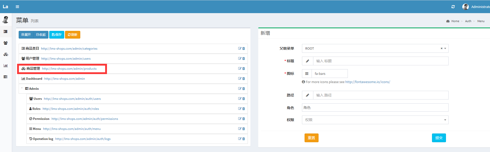
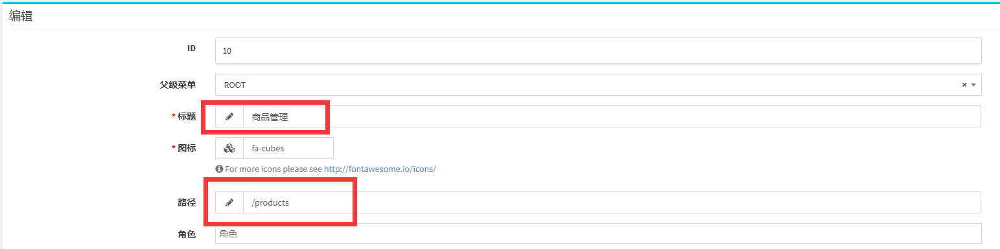
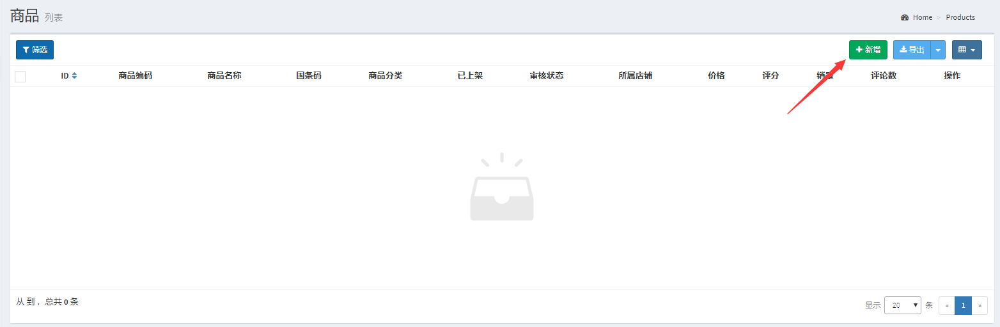
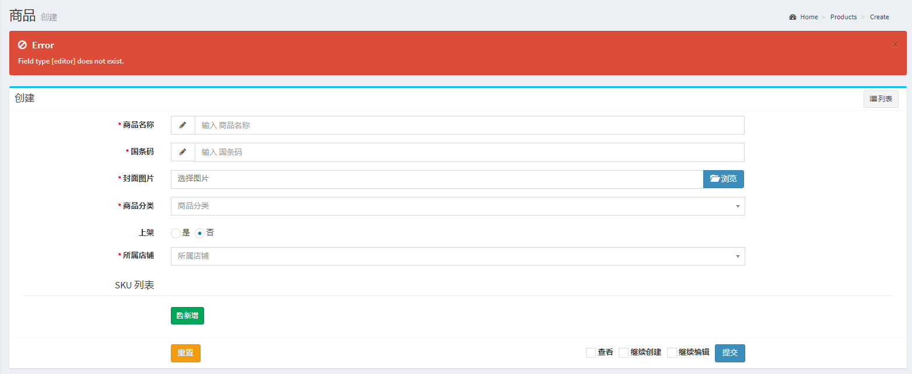
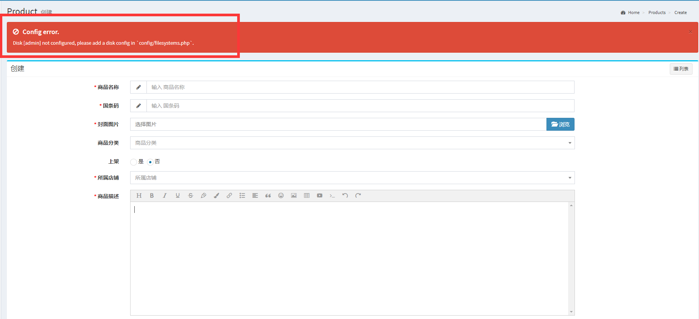

@[TOC](商品管理)
# 1.添加商品管理
##  1.1.添加数据表
	CREATE TABLE `product_descriptions` (
	  `id` int unsigned NOT NULL AUTO_INCREMENT,
	  `product_id` int DEFAULT NULL,
	  `description` text CHARACTER SET utf8 COLLATE utf8_general_ci,
	  PRIMARY KEY (`id`) USING BTREE
	) ENGINE=InnoDB
	
	CREATE TABLE `product_sku_descriptions` (
	  `id` int NOT NULL,
	  `product_sku_id` int DEFAULT NULL,
	  `description` text CHARACTER SET utf8 COLLATE utf8_general_ci,
	  PRIMARY KEY (`id`) USING BTREE
	) ENGINE=InnoDB
	
	CREATE TABLE `lms_products` (
	  `id` int unsigned NOT NULL AUTO_INCREMENT,
	  `product_core` char(16) CHARACTER SET utf8 COLLATE utf8_general_ci DEFAULT NULL,
	  `title` varchar(30) CHARACTER SET utf8 COLLATE utf8_general_ci DEFAULT NULL,
	  `bar_code` varchar(50) CHARACTER SET utf8 COLLATE utf8_general_ci DEFAULT NULL,
	  `category_id` int DEFAULT NULL,
	  `status` tinyint(1) DEFAULT NULL,
	  `audit_status` tinyint DEFAULT NULL,
	  `shop_id` int DEFAULT NULL,
	  `description_id` int DEFAULT NULL,
	  `rating` double(8,2) DEFAULT NULL,
	  `sold_count` int DEFAULT NULL,
	  `review_count` int DEFAULT NULL,
	  `price` decimal(10,2) DEFAULT NULL,
	  `image` varchar(200) CHARACTER SET utf8 COLLATE utf8_general_ci DEFAULT NULL,
	  `created_at` datetime DEFAULT NULL,
	  `updated_at` datetime DEFAULT NULL,
	  PRIMARY KEY (`id`) USING BTREE
	) ENGINE=InnoDB
##  1.2.商品后台列表
###  1.2.1.创建控制器
	php artisan admin:make ProductsController --model=App\\Models\\Product
###  1.2.2.添加菜单

###  1.2.3.添加路由
	$router->get('products', 'ProductsController@index');
    $router->get('products/create', 'ProductsController@create');
    $router->post('products', 'ProductsController@store');
    $router->get('products/{id}/edit', 'ProductsController@edit');
    $router->put('products/{id}', 'ProductsController@update');
# 2.添加富文本组件
## 2.1.修改控制器
	<?php
	/**
	 * Make a form builder.
	 *
	 * @return Form
	 */
	protected function form()
	{
	  $form = new Form(new Product);
	
	  // 创建一个输入框，第一个参数 title 是模型的字段名，第二个参数是该字段描述
	  $form->text('title', '商品名称')->rules('required');
	
	  $form->text('bar_code','国条码')->rules('required');
	  // 创建一个选择图片的框
	  $form->image('image', '封面图片')->rules('required|image');
	
	  $form->select('category_id','商品分类')->options(function ($id){
	    $category = Category::find($id);
	    if ($category) {
	      return [$category->id => $category->full_name];
	    }
	  })->ajax('/admin/api/categories?is_directory=0');
	
	
	  // 创建一组单选框
	  $form->radio('status', '上架')->options(['1' => '是', '0'=> '否'])->default('0');
	
	  $form->select('shop_id','所属店铺')->options(function (){
	    $shop = Shop::select('id','name')->where('admin_user_id',Auth::guard('admin')->user()->id)->get();
	    $array= [];
	    if ($shop) {
	      foreach ($shop as $key => $values) {
	        $array[$values->id] = $values->name;
	      }
	    }
	    return $array;
	  })->rules('required');
	
	  //创建一个富文本编辑器
	  $form->editor('productdescriptions.description','商品描述')->rules('required');
	
	  return $form;
	}
##  测试添加商品

	
	会出现如下错误

##  安装富文本组件
	文档地址：https://github.com/laravel-admin-extensions/quill
	1.composer require laravel-admin-ext/wang-editor
	
	2.php artisan vendor:publish --tag=laravel-admin-wangEditor
	
	3.然后在 config/admin.php 的最下方找到 extensions 段，增加以下内容：
		<?php
		'extensions' => [
	    'wang-editor' => [
	
	        // 如果要关掉这个扩展，设置为false
	        'enable' => true,
	
	        // 编辑器的配置
	        'config' => [
	
	        ]
	    ]
	]
	
	4.注销掉App/admin中的bootstrap.php里边的
	Encore\Admin\Form::forget(['map', 'editor']);
`注:必要的时候在执行下php artisan config:clear 清理下配置缓存`
	
完成1,2,3,4部后任然会有错误

	 
	  5.在config/filesystems.php中添加：
	  'admin' => [
            'driver' => 'local',
            'root' => public_path('upload'),
            'visibility' => 'public',
            'url' => env('APP_URL') . '/public/upload/',
        ],

这样wang-editor组件就完美的接入进来了